# AGENTS.md

This file provides guidance for AI agents working in the Nebula ID repository.

## Project Overview

Nebula ID is an enterprise-grade distributed ID generation system written in Rust, supporting multiple ID generation algorithms (Segment, Snowflake, UUID v7/v4) with high availability, distributed coordination, and monitoring capabilities.

## Build Commands

```bash
# Development build (default features: postgresql)
cargo build --package nebulaid

# Production release build
cargo build --package nebulaid --release

# Build with all features (postgresql + sqlite + etcd)
cargo build --package nebulaid --all-features

# Build with specific feature
cargo build --package nebulaid --features etcd
```

## Lint & Format Commands

```bash
# Check code formatting
cargo fmt --all -- --check

# Format code
cargo fmt --all

# Run Clippy lints
cargo clippy --lib --bins -- -D warnings

# Run pre-commit checks (format, clippy, build, tests)
./scripts/pre-commit-check.sh
```

## Pre-commit Hooks

The project uses both [pre-commit](https://pre-commit.com/) and [lefthook](https://github.com/evilmartians/lefthook) for git hook management.

```bash
# Install lefthook hooks (recommended)
lefthook install

# Install pre-commit hooks (alternative)
./scripts/install-pre-commit-hooks.sh

# Manually run all pre-commit hooks on all files
pre-commit run --all-files

# Update pre-commit hooks to latest versions
pre-commit autoupdate
```

### Hooks Configuration (`.pre-commit-config.yaml` + `lefthook.yml`)

| Hook | Command | Purpose |
|------|---------|---------|
| cargo-fmt | `cargo fmt --all -- --check` | Code formatting |
| cargo-clippy | `cargo clippy --lib --bins` | Static analysis |
| cargo-check | `cargo check --package nebulaid` | Compilation check |

### Troubleshooting

If pre-commit fails with "command not found":
```bash
# Add pip user bin to PATH
export PATH="$HOME/.local/bin:$PATH"

# Reinstall if needed
pip install --user --upgrade pre-commit
```

## Test Commands

```bash
# Run all tests with 4 threads
cargo test --package nebulaid --all-features -- --test-threads=4

# Run all tests including slow tests
cargo test --package nebulaid --all-features

# Run specific test by name
cargo test --package nebulaid --all-features test_segment

# Run tests in a specific module
cargo test --package nebulaid --all-features --lib algorithm::segment

# Run tests matching a pattern
cargo test --package nebulaid --all-features -- segment_
cargo test --package nebulaid --all-features -- degradation_

# Run with output capture disabled
cargo test --package nebulaid --all-features -- --nocapture

# Test coverage
cargo tarpaulin --out Html
```

## CI/CD Workflows

GitHub Actions workflows are located in `.github/workflows/`:

| Workflow | Trigger | Purpose |
|----------|---------|---------|
| `ci.yml` | Push/PR | Main CI: lint, build, test, security audit |
| `codeql.yml` | Push/PR | GitHub CodeQL semantic security analysis |
| `code-review.yml` | Push/PR | AI-powered code review |
| `health-check.yml` | Schedule | Repository health metrics |
| `release.yml` | Tag `v*` | Multi-platform release builds |

### CI Pipeline (ci.yml)

```bash
# Jobs run in sequence: quick-check → build → test → security-audit
```

**Quick Check Job:**
- Format validation: `cargo fmt --all -- --check`
- Clippy lint (lib + bins only): `cargo clippy --lib --bins`

**Build Job:**
- Compile the package: `cargo build --package nebulaid --all-features`

**Test Job:**
- Run all tests: `cargo test --package nebulaid --all-features`
- Generate coverage for PRs (codecov)

**Security Audit Job:**
- Vulnerability scanning: `cargo deny check security`
- CodeQL semantic analysis (separate `codeql.yml` workflow)

### Pre-commit Check Script

Use the local CI script before committing:

```bash
./scripts/pre-commit-check.sh
```

This runs the same checks as the CI pipeline locally.

## Code Style Guidelines

### Imports

```rust
// 1. Standard library imports first
use std::sync::{Arc, Mutex};
use std::time::Duration;

// 2. External crate imports (alphabetically)
use async_trait::async_trait;
use dashmap::DashMap;
use tokio::sync::mpsc;

// 3. Local crate imports (use crate::)
use crate::algorithm::{IdAlgorithm, HealthStatus};
use crate::config::Config;
use crate::types::{CoreError, Result};

// Group by crate, then alphabetically within groups
```

### Formatting

- Use `rustfmt` default settings (4 spaces, snake_case file names)
- Keep lines under 120 characters
- Use blank lines to group related code (2-3 lines max)
- Place `#[cfg(test)]` modules at the end of files
- Add license header to new files:

```rust
// Copyright © 2026 Kirky.X
//
// Licensed under the Apache License, Version 2.0 (the "License");
// you may not use this file except in compliance with the License.
// You may obtain a copy of the License at
//
//     http://www.apache.org/licenses/LICENSE-2.0
//
// Unless required by applicable law or agreed to in writing, software
// distributed under the License is distributed on an "AS IS" BASIS,
// WITHOUT WARRANTIES OR CONDITIONS OF ANY KIND, either express or implied.
// See the License for the specific language governing permissions and
// limitations under the License.
```

### Naming Conventions

| Item | Convention | Example |
|------|------------|---------|
| Modules | `snake_case` | `segment`, `cache` |
| Structs | `PascalCase` | `SegmentAlgorithm`, `CpuMonitor` |
| Enums | `PascalCase` | `CoreError`, `HealthStatus` |
| Variants | `PascalCase` | `ClockMovedBackward` |
| Functions | `snake_case` | `generate_id()`, `start_monitoring()` |
| Variables | `snake_case` | `current_usage`, `max_id` |
| Constants | `SCREAMING_SNAKE_CASE` | `DEFAULT_CPU_USAGE` |
| Type parameters | `PascalCase` | `T`, `Result<T, E>` |
| Config fields | `snake_case` | `max_connections`, `api_key` |

### Visibility Rules

```rust
// Public API (re-exported in lib.rs)
pub mod algorithm;
pub use algorithm::IdAlgorithm;

// Crate-internal only
pub(crate) mod config_management;
pub(crate) const INTERNAL_CONST: u64 = 1000;

// Module-private (default)
struct PrivateStruct;
fn helper_function() {}
```

### Error Handling

Use `thiserror` for enum errors with `#[derive_more::Display]`:

```rust
use derive_more::Display;
use thiserror::Error;

#[derive(Debug, Error, Display)]
pub enum CoreError {
    #[display("Database error: {}", _0)]
    DatabaseError(String),

    #[display("Segment exhausted, max_id: {}", max_id)]
    SegmentExhausted { max_id: u64 },

    #[display("Invalid ID format: {}", _0)]
    InvalidIdFormat(String),
}

// Use ? operator and From implementations
impl From<std::io::Error> for CoreError {
    fn from(e: std::io::Error) -> Self {
        CoreError::DatabaseError(e.to_string())
    }
}

pub type Result<T> = std::result::Result<T, CoreError>;
```

### Async Patterns

- Use `tokio` as the async runtime
- Prefer `async/.await` over blocking operations
- Use `Arc<Mutex<T>>` or `dashmap::DashMap` for shared state
- Use `tokio::sync` primitives (`mpsc`, `oneshot`, `watch`)
- Use `parking_lot` for faster mutex operations

### Documentation

Document public APIs with doc comments:

```rust
/// Generates unique IDs using the Segment algorithm.
///
/// This algorithm provides high-throughput, ordered ID generation
/// with database-backed segment allocation.
///
/// # Errors
///
/// Returns `CoreError::SegmentExhausted` when the current segment
/// is fully utilized and database refresh fails.
pub async fn generate_id(&self, ctx: &GenerateContext) -> Result<Id>;
```

### Module Organization

```mermaid
graph TD
    Root["src/"] --> Core["core/"]
    Root --> Server["server/"]
    Root --> Infra["infrastructure/"]
    Root --> Lib["lib.rs"]
    Root --> Main["main.rs"]
    Root --> Build["build.rs"]

    Core --> Algo["algorithm/<br/>segment, snowflake, uuid_v7,<br/>circuit_breaker, router, degradation_manager"]
    Core --> Auth["auth/"]
    Core --> Config["config/"]
    Core --> Container["container/<br/>app_container (DI)"]
    Core --> Coord["coordinator/<br/>etcd cluster health, worker allocator"]
    Core --> DB["database/<br/>SeaORM entities & repository"]
    Core --> Mon["monitoring/"]
    Core --> Types["types/<br/>id, error, metrics, segment_info"]
    Core --> Tests["tests/<br/>integration, degradation, cache, dynamic_step"]

    Server --> MW["middleware/<br/>api_key_auth, size_limit, utils"]
    Server --> Rate["rate_limit/<br/>limiter, middleware"]
    Server --> Handlers["handlers/"]
    Server --> Audit["audit/"]
    Server --> Cfg["config/<br/>tls, cors, hot_reload, server, management"]
    Server --> Proto["proto/<br/>gRPC protobuf generated"]
    Server --> Router["router.rs, openapi.rs, grpc.rs"]

    Infra --> Repos["repositories/"]
    Infra --> Adapter["config_adapter,<br/>config_provider, database_adapter"]

    style Root fill:#e1f5ff
    style Core fill:#b3e5fc
    style Server fill:#c8e6c9
    style Infra fill:#fff9c4
```



**Key modules:**
- `src/core/algorithm/` - ID generation algorithms (Segment, Snowflake, UUID v7/v4) with circuit breaker, degradation manager, and router
- `src/core/container/app_container.rs` - Dependency injection container
- `src/core/coordinator/` - Etcd-based distributed coordination (leader election, worker allocation, cluster health)
- `src/core/database/` - SeaORM entities and repository layer
- `src/server/middleware/` - HTTP middleware (API key auth, size limit)
- `src/server/rate_limit/` - Rate limiting (powered by `limiteron`)
- `src/server/config/` - Server configuration (TLS, CORS, hot reload)
- `src/infrastructure/` - Infrastructure adapters and repository implementations

### Testing

- Place unit tests in `tests/` module at the end of source files
- Place integration tests in `src/core/tests/` directory
- Use `#[cfg(test)]` to mark test modules
- Follow naming convention: `test_*` or `should_*`

```rust
#[cfg(test)]
mod tests {
    use super::*;

    #[tokio::test]
    async fn test_segment_generation() {
        let segment = SegmentAlgorithm::new();
        let id = segment.generate_id(&ctx).await;
        assert!(id.is_ok());
    }
}
```

## Dependencies

All dependencies are defined in the single-package `Cargo.toml` (no workspace). Key external libraries:

| Library | Version | Purpose |
|---------|---------|---------|
| `confers` | 0.4 | Configuration management |
| `oxcache` | 0.3 | Multi-level cache abstraction |
| `dbnexus` | 0.4 | Database abstraction (postgres) |
| `limiteron` | 0.2 | Rate limiting (quota-control, ban-manager) |
| `sdforge` | 0.4 | Service discovery (http, grpc) |
| `sea-orm` | 1.1 | Database ORM |
| `axum` | 0.8 | HTTP framework |
| `tonic` | 0.14 | gRPC framework |
| `etcd-client` | 0.17 | Etcd client (optional, `etcd` feature) |

When adding new dependencies, edit `Cargo.toml` `[dependencies]` directly. Prefer `default-features = false` and explicit feature lists (rule 28).

## Database Migrations

```bash
# Run migrations
cargo run --bin nebula-id -- migrate

# Initialize database schema
psql -U idgen -d idgen -f scripts/init.sql
```

## Debugging

```bash
# Enable debug logging
RUST_LOG=debug cargo run --bin nebula-id

# Module-specific logging
RUST_LOG=nebulaid::core::algorithm=debug cargo run --bin nebula-id
```
