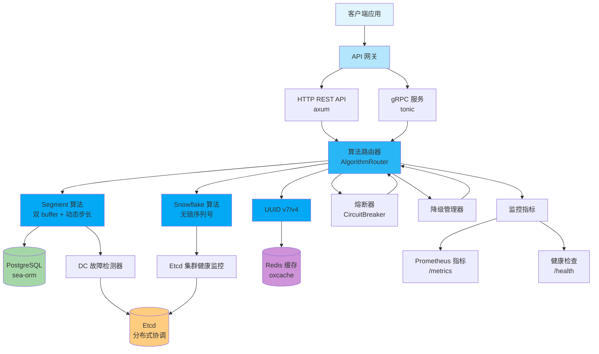
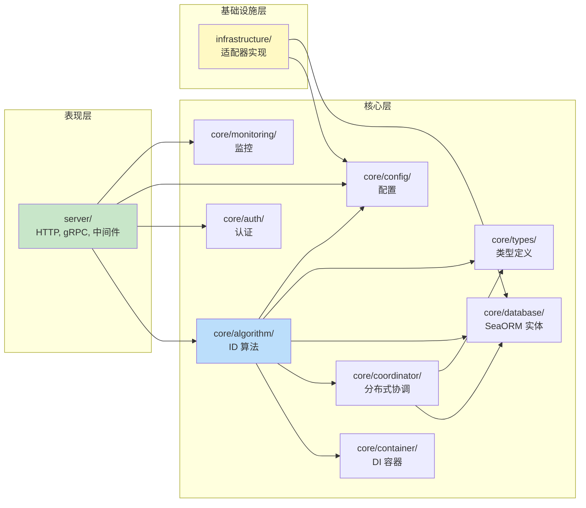
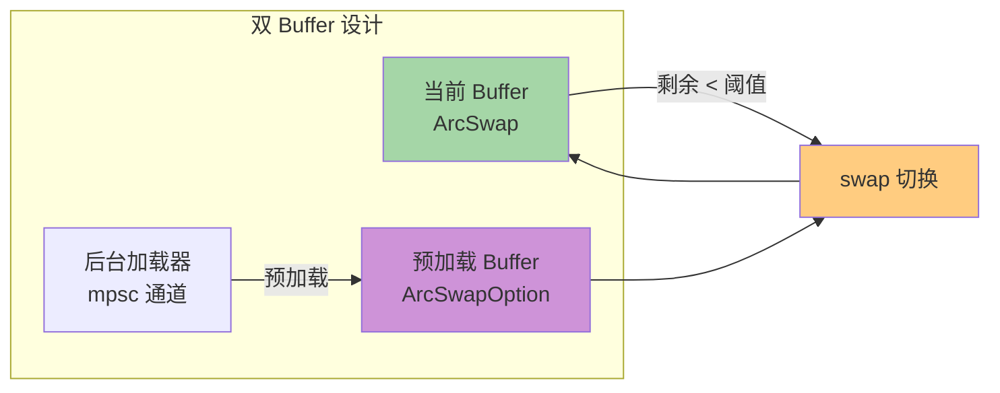
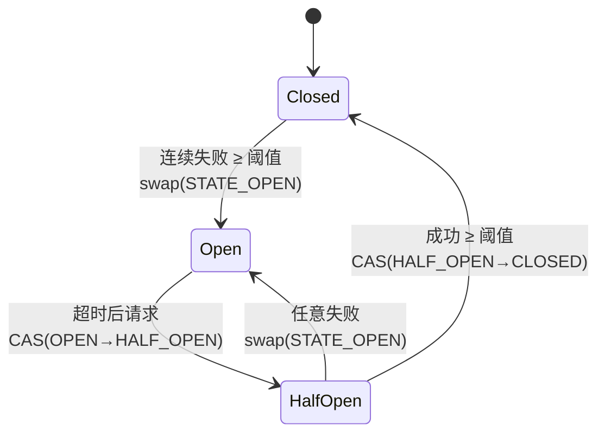

# Nebula ID 架构文档

> 本文档描述 Nebula ID 的整体架构、模块依赖关系、外部库角色与算法优化设计。

## 1. 项目整体架构



## 2. 模块依赖关系



## 3. 外部库角色

项目通过 5 个 crates.io 外部库实现基础设施解耦：

| 库 | 版本 | 角色 | 使用方式 |
|----|------|------|----------|
| `confers` | 0.4 | 配置管理 | 提供 `ConfigProvider` trait 与环境变量展开 |
| `oxcache` | 0.3 | 多级缓存 | 提供 `Cache` 抽象（内存 + Redis） |
| `dbnexus` | 0.4 | 数据库抽象 | 提供 PostgreSQL 连接池与事务管理 |
| `limiteron` | 0.2 | 限流 | 提供 quota-control 与 ban-manager 特性 |
| `sdforge` | 0.4 | 服务发现 | 提供 HTTP 与 gRPC 服务发现 |

**依赖特性化原则（规则 28）：**
- 所有外部库均使用 `default-features = false`，显式声明所需特性
- `dbnexus`: `features = ["postgres", "runtime-tokio-rustls"]`
- `sdforge`: `features = ["http", "grpc"]`
- `limiteron`: `features = ["postgres", "quota-control", "ban-manager"]`

## 4. 算法优化设计

### 4.1 Segment 算法 — 双 buffer 无锁化



**优化点：**
- `ArcSwap` 替代 `Mutex<Arc<T>>`：读取无锁，写入 CAS
- `check_recovery` 持读锁迭代 + AtomicU8 内部修改：仅修改原子状态，不影响 HashMap 结构
- `get_or_create_buffer` 快路径（读锁）+ 慢路径（写锁）减少锁竞争
- `need_switch` 合并两次锁为一次，减少锁开销

### 4.2 Snowflake 算法 — 序列号无锁化

**优化点：**
- `AtomicU64` 存储序列号，`fetch_add` 实现无锁递增
- `OnceLock` 缓存 epoch 起点，避免每次 `checked_add`
- `rotation_count` 使用 `Ordering::Relaxed`（仅统计用途，无内存序依赖）
- 序列号溢出检测：`seq & sequence_mask == 0` 触发等待下一毫秒

### 4.3 Circuit Breaker — 全无锁状态机



**优化点：**
- `AtomicU8` 编码状态（Closed=0, Open=1, HalfOpen=2）
- `AtomicU64` 存储 Instant 纳秒时间戳（相对全局起点），避免 `Mutex<Option<Instant>>`
- 状态转换使用 CAS（`compare_exchange`）避免多线程同时转换
- `transition_to_open` 使用 `swap` 确保状态立即生效

## 5. mod.rs 接口隔离标准（规则 25）

`mod.rs` 只允许包含：
- `trait` 定义
- `pub` 结构体/枚举
- `pub` 类型别名
- `pub use` re-export

具体实现函数必须拆到独立文件。例如：
- `src/core/types/mod.rs` — 只放 re-export，`SegmentInfo` 拆到 `segment_info.rs`
- `src/server/middleware/mod.rs` — `api_key_auth` 拆到 `api_key_auth.rs`（489 行）

## 6. 版权头标准

所有手写 `.rs` 文件必须包含以下版权头：

```rust
// Copyright © 2026 Kirky.X
//
// Licensed under the Apache License, Version 2.0 (the "License");
// you may not use this file except in compliance with the License.
// You may obtain a copy of the License at
//
//     http://www.apache.org/licenses/LICENSE-2.0
//
// Unless required by applicable law or agreed to in writing, software
// distributed under the License is distributed on an "AS IS" BASIS,
// WITHOUT WARRANTIES OR CONDITIONS OF ANY KIND, either express or implied.
// See the License for the specific language governing permissions and
// limitations under the License.
```

**例外：** 自动生成的 protobuf 文件（`src/server/proto/`）不需要版权头。

## 7. 跨平台支持（规则 31）

- CPU 监控：`#[cfg(target_os = "linux")]` 读取 `/proc/stat`，其他平台返回默认值
- 无硬编码路径分隔符
- 使用跨平台库（`tokio`、`parking_lot`、`arc-swap`）

## 相关文档

- [API 参考](API_REFERENCE.md)
- [部署指南](DEPLOYMENT.md)
- [贡献指南](CONTRIBUTING.md)
- [用户指南](USER_GUIDE.md)
