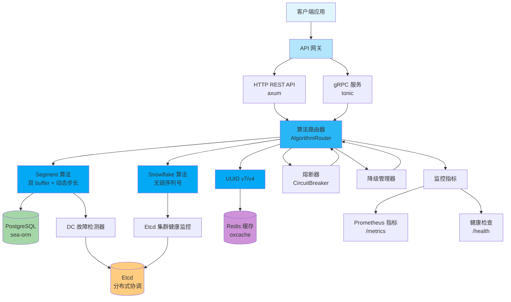
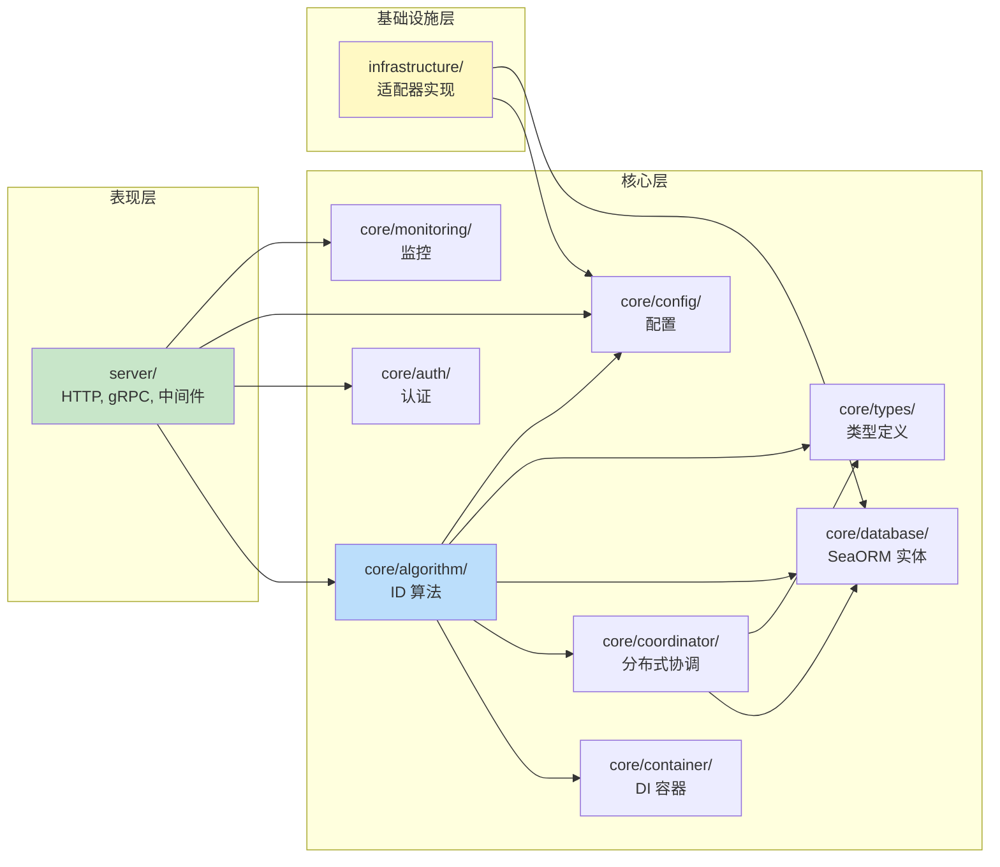
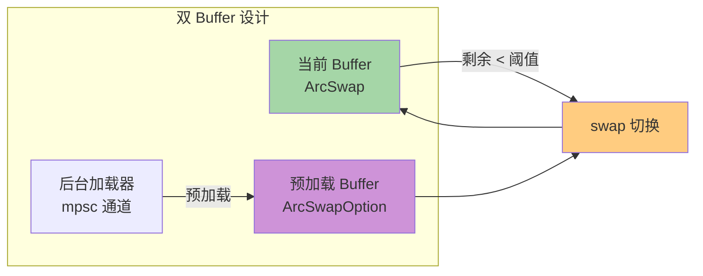
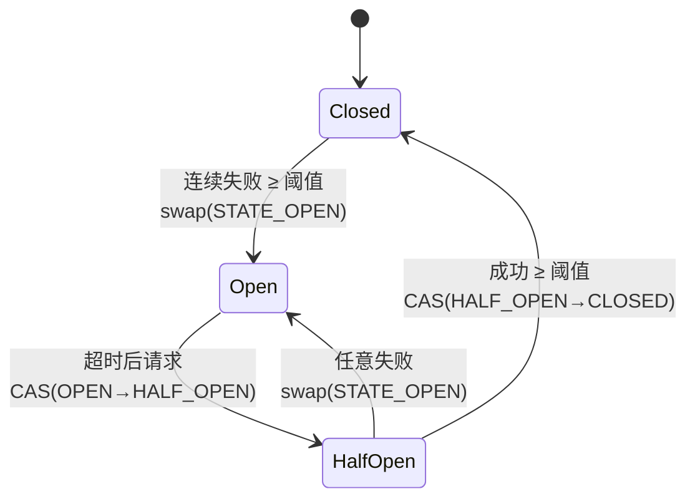

# Nebula ID 架构文档

> 本文档描述 Nebula ID 的整体架构、模块依赖关系、外部库角色与算法优化设计。

## 1. 项目整体架构



## 2. 模块依赖关系



## 3. 外部库角色

项目通过 5 个 crates.io 外部库实现基础设施解耦：

| 库 | 版本 | 角色 | 使用方式 |
|----|------|------|----------|
| `confers` | 0.4 | 配置管理 | 提供 `ConfigProvider` trait 与环境变量展开 |
| `oxcache` | 0.3 | 多级缓存 | 提供 `Cache` 抽象（内存 + Redis） |
| `dbnexus` | 0.4 | 数据库抽象 | 提供 PostgreSQL 连接池与事务管理 |
| `limiteron` | 0.2 | 限流 | 提供 quota-control 与 ban-manager 特性 |
| `sdforge` | 0.4 | 服务发现 | 提供 HTTP 与 gRPC 服务发现 |

**依赖特性化原则（规则 28）：**
- 所有外部库均使用 `default-features = false`，显式声明所需特性
- `dbnexus`: `features = ["postgres", "runtime-tokio-rustls"]`
- `sdforge`: `features = ["http", "grpc"]`
- `limiteron`: `features = ["postgres", "quota-control", "ban-manager"]`

## 4. 算法优化设计

### 4.1 Segment 算法 — 双 buffer 无锁化



**优化点：**
- `ArcSwap` 替代 `Mutex<Arc<T>>`：读取无锁，写入 CAS
- `check_recovery` 持读锁迭代 + AtomicU8 内部修改：仅修改原子状态，不影响 HashMap 结构
- `get_or_create_buffer` 快路径（读锁）+ 慢路径（写锁）减少锁竞争
- `need_switch` 合并两次锁为一次，减少锁开销

### 4.2 Snowflake 算法 — 序列号无锁化

**优化点：**
- `AtomicU64` 存储序列号，`fetch_add` 实现无锁递增
- `OnceLock` 缓存 epoch 起点，避免每次 `checked_add`
- `rotation_count` 使用 `Ordering::Relaxed`（仅统计用途，无内存序依赖）
- 序列号溢出检测：`seq & sequence_mask == 0` 触发等待下一毫秒

### 4.3 Circuit Breaker — 全无锁状态机



**优化点：**
- `AtomicU8` 编码状态（Closed=0, Open=1, HalfOpen=2）
- `AtomicU64` 存储 Instant 纳秒时间戳（相对全局起点），避免 `Mutex<Option<Instant>>`
- 状态转换使用 CAS（`compare_exchange`）避免多线程同时转换
- `transition_to_open` 使用 `swap` 确保状态立即生效

## 5. mod.rs 接口隔离标准（规则 25）

`mod.rs` 只允许包含：
- `trait` 定义
- `pub` 结构体/枚举
- `pub` 类型别名
- `pub use` re-export

具体实现函数必须拆到独立文件。例如：
- `src/core/types/mod.rs` — 只放 re-export，`SegmentInfo` 拆到 `segment_info.rs`
- `src/server/middleware/mod.rs` — `api_key_auth` 拆到 `api_key_auth.rs`（489 行）

## 6. 版权头标准

所有手写 `.rs` 文件必须包含以下版权头：

```rust
// Copyright © 2026 Kirky.X
//
// Licensed under the Apache License, Version 2.0 (the "License");
// you may not use this file except in compliance with the License.
// You may obtain a copy of the License at
//
//     http://www.apache.org/licenses/LICENSE-2.0
//
// Unless required by applicable law or agreed to in writing, software
// distributed under the License is distributed on an "AS IS" BASIS,
// WITHOUT WARRANTIES OR CONDITIONS OF ANY KIND, either express or implied.
// See the License for the specific language governing permissions and
// limitations under the License.
```

**例外：** 自动生成的 protobuf 文件（`src/server/proto/`）不需要版权头。

## 7. 跨平台支持（规则 31）

- CPU 监控：`#[cfg(target_os = "linux")]` 读取 `/proc/stat`，其他平台返回默认值
- 无硬编码路径分隔符
- 使用跨平台库（`tokio`、`parking_lot`、`arc-swap`）

## 8. i18n 模块位置

自 v0.2.0 起，ICU 国际化层在系统架构中的位置如下：

```mermaid
graph LR
    Client[客户端请求<br/>Accept-Language 头] --> Gateway[API 网关<br/>axum Router]
    Gateway --> LocaleMW[locale_middleware<br/>src/server/middleware/locale.rs]
    LocaleMW -->|Extension&lt;Locale&gt;| V1Routes[/api/v1/* 路由]
    V1Routes --> Handlers[业务 Handlers<br/>src/server/handlers/*.rs]
    Handlers -->|错误转换| Helpers[helpers.rs<br/>core_error_to_response]
    Helpers --> I18n[i18n 模块<br/>src/core/i18n.rs]
    I18n -->|translate_with_locale_args| Locales[(locales/en.yml<br/>locales/zh-CN.yml)]
    Locales -->|rust-i18n 3.1 编译期嵌入| I18n

    style LocaleMW fill:#ffcc80
    style I18n fill:#ce93d8
    style Locales fill:#a5d6a7
```

**关键设计决策：**

- **不修改全局 locale 状态**：`translate_with_locale*` 函数直接读取 `Locale` 参数并查询 `rust-i18n` 编译期嵌入的静态数据，绝不调用 `set_locale`，因此可在并发请求间安全使用（无 `Mutex` / 全局可变状态）。
- **中间件边界**：`locale_middleware` 仅作用于 `/api/v1/*` 路由（Phase 8 T041 M4 性能修复），避免 `/health` / `/ready` / `/metrics` / `/api-docs/openapi.json` 等不消费 `Locale` 的请求承担 `Accept-Language` 解析成本。
- **fallback 链**：缺少 key 时 `rust-i18n` 先回退到默认 locale (`en`)，再回退到 key 本身（绝不返回空串），保证错误响应永远有可读消息。
- **隐藏 API 使用**：`translate_with_locale_cow` 通过 `crate::_rust_i18n_try_translate`（`i18n!` 宏生成的 `#[doc(hidden)] pub fn`）实现按 locale 翻译。`rust-i18n` 已 pin 到 `3.1`（Major.Minor），若 4.x 暴露稳定 API 再迁移。
- **依赖特性化（规则 28）**：`rust-i18n = { version = "3.1", default-features = false }` 禁用默认 `accept-language` 特性，因为本项目在 `locale.rs` 中提供了更严格（RFC 7231 §5.3.5 + DoS 防护）的解析器。

## 9. EtcdClientOps trait 关系图（Phase 6）

`EtcdClientOps` trait 解耦了 etcd 业务逻辑与 `etcd_client::Client`，使分布式协调器可在单元测试中 mock 注入。关系如下：

```mermaid
graph TB
    subgraph Trait层
        Trait[EtcdClientOps trait<br/>src/core/coordinator/etcd.rs<br/>6 方法: kv_get/kv_delete/<br/>lease_grant/lease_revoke/<br/>txn_check_create_rev_and_put/ping]
        Err[EtcdError enum<br/>Network/KeyNotFound/<br/>LeaseInvalid/Internal]
    end

    subgraph 实现层
        Wrapper[EtcdClientWrapper<br/>tokio::sync::Mutex&lt;etcd_client::Client&gt;<br/>impl EtcdClientOps]
        Mock[MockEtcdClientOps<br/>#[cfg(test)] mockall::mock!]
    end

    subgraph 调用方
        Lock[EtcdDistributedLock<br/>client: Arc&lt;dyn EtcdClientOps&gt;]
        Allocator[EtcdWorkerAllocator<br/>client: Arc&lt;dyn EtcdClientOps&gt;]
        Monitor[EtcdClusterHealthMonitor<br/>client: Option&lt;Arc&lt;dyn EtcdClientOps&gt;&gt;]
    end

    Wrapper -.->|impl| Trait
    Mock -.->|impl test only| Trait
    Trait -->|Arc&lt;dyn EtcdClientOps&gt; 注入| Lock
    Trait -->|Arc&lt;dyn EtcdClientOps&gt; 注入| Allocator
    Trait -->|Option&lt;Arc&lt;dyn EtcdClientOps&gt;&gt; 注入| Monitor
    Trait -->|返回值| Err

    style Trait fill:#bbdefb
    style Err fill:#ffcdd2
    style Wrapper fill:#a5d6a7
    style Mock fill:#fff9c4
    style Lock fill:#ffcc80
    style Allocator fill:#ffcc80
    style Monitor fill:#ffcc80
```

**注入路径：**

- **生产路径**：`EtcdClusterHealthMonitor::new` 构造时 `client = None`，每次健康检查时新建 `etcd_client::Client`（行为与 v0.1.x 一致，无破坏性变更）。
- **测试路径**：通过 `new_with_client(Arc::new(MockEtcdClientOps))` 注入 mock，单元测试可在不连接真实 etcd 的情况下验证业务逻辑。
- **接口隔离（规则 25）**：`EtcdClientOps` 与 `EtcdError` 在 `src/core/coordinator/mod.rs` re-export，调用方通过 `crate::core::coordinator::EtcdClientOps` 引用，实现细节隐藏在 `etcd.rs` 子模块。
- **`kv_put` 故意省略**：架构审查发现无业务调用方需要 `kv_put`（所有写入都通过 `txn_check_create_rev_and_put` 原子 CAS 完成），按规则 2（简洁优先）从 trait 中删除。

## 10. ConfigManagementService trait 关系图（Phase 7）

`ConfigManagementService` trait 解耦了 HTTP handlers 与具体 `ConfigManager` 实现，使 handlers 可在 mock 环境下完整测试。关系如下：

```mermaid
graph TB
    subgraph Trait层
        Trait[ConfigManagementService trait<br/>src/server/config/management.rs<br/>~18 方法: get_config/get_secure_config/<br/>get_batch_max_size/update_rate_limit/<br/>update_logging/reload_config/<br/>set_algorithm/biz_tag CRUD/<br/>workspace&amp;group CRUD/metrics]
    end

    subgraph 实现层
        Manager[ConfigManager<br/>生产实现<br/>impl ConfigManagementService]
        MockCfg[MockConfigManagementService<br/>#[cfg(test)] mockall::mock!]
    end

    subgraph 调用方
        Handlers[ApiHandlers<br/>config_service: Arc&lt;dyn ConfigManagementService&gt;<br/>src/server/handlers/mod.rs]
        Router[create_router<br/>AppState.config_service:<br/>Arc&lt;dyn ConfigManagementService&gt;]
        Main[src/main.rs<br/>Arc::new(ConfigManager::new(...))<br/>coerce to Arc&lt;dyn ConfigManagementService&gt;]
    end

    Manager -.->|impl| Trait
    MockCfg -.->|impl test only| Trait
    Main -->|构造并 coerce| Trait
    Trait -->|Arc&lt;dyn ...&gt; 注入| Handlers
    Handlers -->|get_config_service| Router

    style Trait fill:#bbdefb
    style Manager fill:#a5d6a7
    style MockCfg fill:#fff9c4
    style Handlers fill:#ffcc80
    style Router fill:#ffcc80
    style Main fill:#c8e6c9
```

**重构要点：**

- **命名让位**：原 `ConfigManagementService` struct 重命名为 `ConfigManager`，让 trait 占据规范名称。所有调用方使用 `Arc<dyn ConfigManagementService>` 引用 trait，实现细节由 `ConfigManager` 隐藏。
- **构造时 coerce**：`src/main.rs` 中 `Arc::new(ConfigManager::new(...))` 自动 coerce 为 `Arc<dyn ConfigManagementService>`，无需显式 cast。
- **测试覆盖**：`src/server/handlers/mod.rs` 的 `#[cfg(test)] mod tests` 用 `mockall::mock!` 定义 `MockConfigManagementService`，覆盖全部 ~18 个 trait 方法。55 个新增测试使 handlers 模块覆盖率 ≥ 95%。
- **接口隔离（规则 25）**：`ConfigManagementService` trait 在 `src/server/config/management.rs` 定义，`mod.rs` 仅 re-export；`ApiHandlers` 通过 `Arc<dyn ConfigManagementService>` 字段持有引用，handlers 内部所有调用走 trait method dispatch。

## 相关文档

- [API 参考](API_REFERENCE.md)
- [部署指南](DEPLOYMENT.md)
- [贡献指南](CONTRIBUTING.md)
- [用户指南](USER_GUIDE.md)
