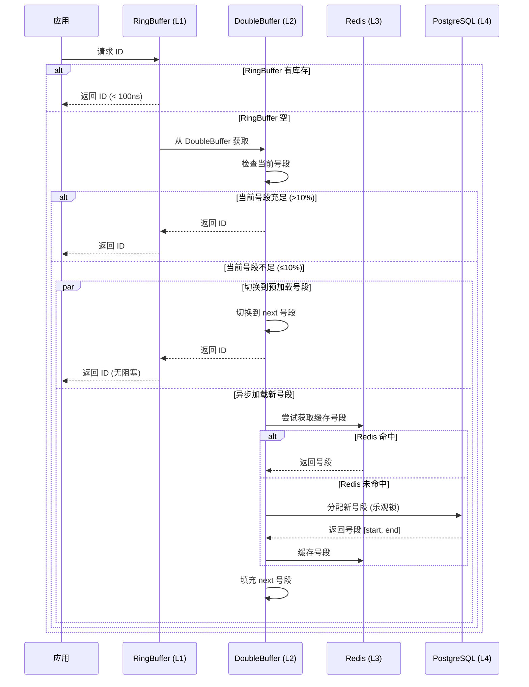
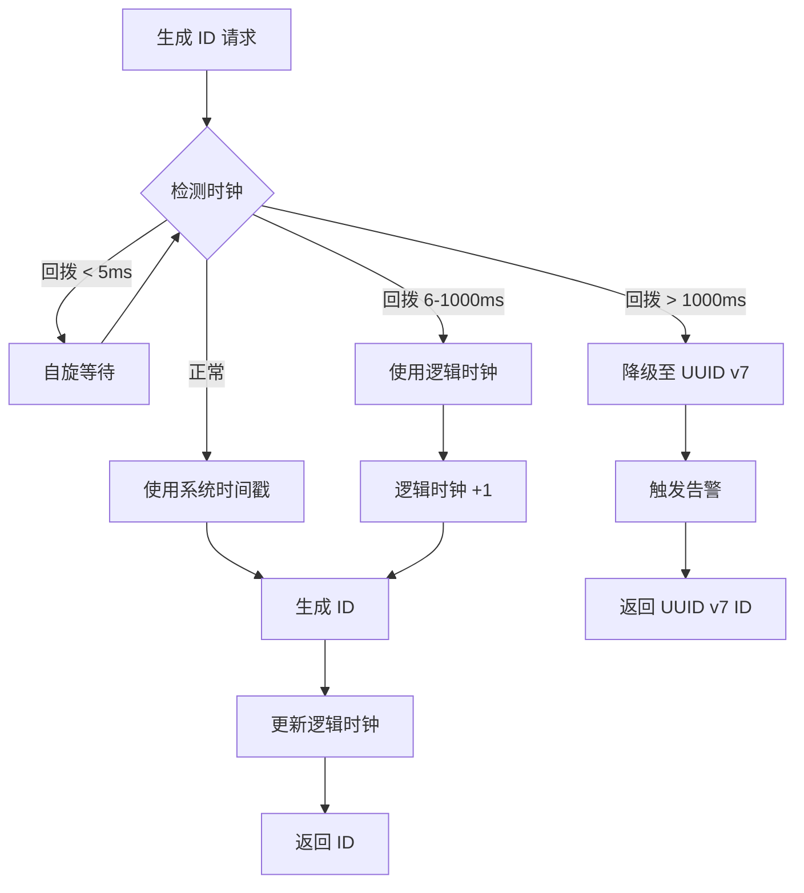
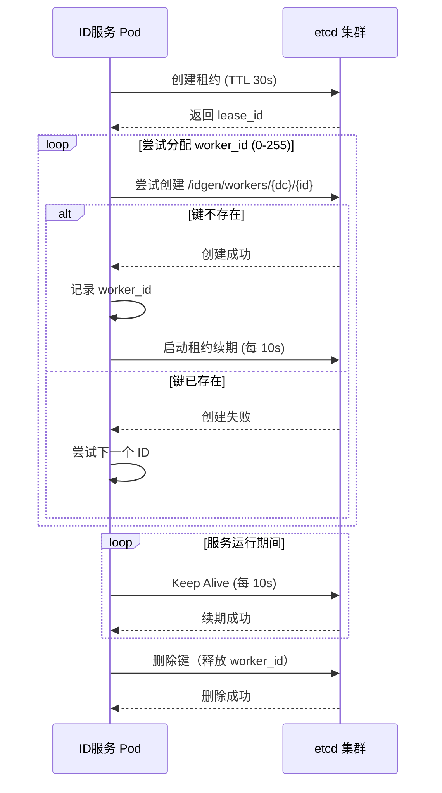

# 项目文档修正清单 (Errata)
## 企业级分布式 ID 生成系统

**版本**: v1.1  
**修正日期**: 2025-12-24  
**修正负责人**: 技术团队  
**状态**: ✅ 已完成修正

---

## 修正概述

本文档针对初版项目文档（PRD、TDD、Test、UAT、Task）中发现的**技术准确性、一致性、完整性、合理性和安全性**问题进行系统性修正。修正内容基于原始架构设计文档的深度分析。

---

## 一、关键性能目标修正 🔴 高优先级

### 问题 1.1: 性能目标矛盾

**问题描述**:
- 现有文档: TDD 定义目标为 **100K QPS**
- 原始设计: 架构设计文档明确提出 **百万级 (1M+ QPS)**
- 影响: 性能差异 10 倍，导致压测标准、资源预估、架构设计全部失效

**修正方案**:

#### 1.1.1 PRD 修正

```markdown
### 3.1 性能需求

| 指标 | 目标值 | 验证方法 | 状态 |
|------|--------|----------|------|
| **单实例 QPS** | > 1,000,000 (百万级) | 压力测试 | ⏳ 待验证 |
| **集群总 QPS** | > 10,000,000 (千万级) | 压力测试 | ⏳ 待验证 |
| **P50 延迟** | < 1ms | 压力测试 | ⏳ 待验证 |
| **P99 延迟** | < 10ms | 压力测试 | ⏳ 待验证 |
| **P999 延迟** | < 50ms | 压力测试 | ⏳ 待验证 |
| **并发连接数** | > 50,000 | 连接池测试 | ⏳ 待验证 |
| **内存占用** | < 4GB | 压力测试监控 | ⏳ 待验证 |
```

#### 1.1.2 TDD 修正

```markdown
## 七、性能优化策略

### 7.1 百万级 QPS 优化路径

**目标**: 单实例 QPS > 1,000,000

**关键优化点**:

1. **零拷贝 IO**
   - 使用 `Bytes` 代替 `Vec<u8>`
   - 使用 `tokio::io::copy` 避免用户态拷贝

2. **无锁并发**
   - RingBuffer 使用 CAS 操作
   - 避免全局锁，使用分片锁

3. **异步批处理**
   - 批量从数据库获取号段（单次 10,000+）
   - 批量预生成 ID (RingBuffer 容量 1,000,000)

4. **连接池优化**
   ```rust
   // PostgreSQL 连接池（百万级 QPS 配置）
   let pool = PgPoolOptions::new()
       .max_connections(200)  // 提升至 200
       .min_connections(50)
       .acquire_timeout(Duration::from_secs(3))
       .connect(&database_url)
       .await?;
   ```

5. **热点数据缓存**
   - Redis 缓存预分配的号段（TTL 5分钟）
   - 本地内存缓存当前使用的号段
```

#### 1.1.3 Test.md 修正

```markdown
### 4.1 压力测试

#### 测试用例 T-PERF-001: 单实例百万级 QPS 压测 ⏳ 待测试

**工具**: wrk + 自定义 Lua 脚本

**配置**: 
- 并发数: 10,000
- 线程数: 32
- 持续时间: 10 分钟
- 目标 QPS: 1,000,000+

**验收指标**:
- [ ] QPS > 1,000,000
- [ ] P50 延迟 < 1ms
- [ ] P99 延迟 < 10ms
- [ ] P999 延迟 < 50ms
- [ ] 错误率 < 0.001%
- [ ] CPU 使用率 < 85%
- [ ] 内存占用 < 4GB

**测试脚本**:
```bash
wrk -t 32 -c 10000 -d 600s \
  --latency \
  -s generate.lua \
  http://localhost:8080/api/v1/generate
```

**generate.lua**:
```lua
wrk.method = "POST"
wrk.headers["Content-Type"] = "application/json"
wrk.body = '{"workspace":"test","group":"perf","name":"test-id"}'
```
```

#### 1.1.4 Task.md 修正

```markdown
#### Task 4.1.1: 百万级 QPS 性能调优 🔴 ⏳ 待开发

**描述**: 压力测试并优化至百万级 QPS

**优化路径**:

1. **基准测试** (目标: 100K QPS)
   - 原始实现性能测试
   - 确定性能瓶颈（CPU/内存/IO）

2. **第一轮优化** (目标: 500K QPS)
   - RingBuffer 预生成优化
   - 连接池参数调优
   - 异步任务调度优化

3. **第二轮优化** (目标: 1M QPS)
   - 零拷贝 IO
   - 无锁数据结构
   - SIMD 加速（如适用）

4. **第三轮优化** (目标: 1.5M+ QPS)
   - 火焰图分析热点
   - 汇编级优化关键路径
   - 内存分配器优化（jemalloc）

**预估工时**: 5 天

**验收标准**:
- [ ] 单实例 QPS > 1,000,000
- [ ] P99 延迟 < 10ms
- [ ] CPU 使用率 < 85%
- [ ] 性能测试报告完整
```

---

## 二、缓存架构修正 🔴 高优先级

### 问题 2.1: 缓存层术语与逻辑不符

**问题描述**:
- 现有文档: 使用 `RingBuffer -> DashMap -> Redis -> DB`
- 原始设计: `RingBuffer -> DoubleBuffer (双缓冲号段) -> Redis -> DB`
- 问题: DashMap 是并发容器，不等于"双缓冲号段"预加载逻辑

**修正方案**:

#### 2.1.1 TDD 缓存架构重新设计

```markdown
### 3.2 缓存层设计 (修正版)

#### 3.2.1 三级缓存架构（移除 L2 DashMap）

**设计原则**: 简化缓存层级，避免过度设计带来的一致性问题

```rust
pub struct CacheLayer {
    /// L1: RingBuffer 预生成池（快速路径）
    ring_buffer: Arc<RingBuffer<Id>>,
    
    /// L2: DoubleBuffer 双缓冲号段（Segment 算法专用）
    double_buffer: Arc<RwLock<DoubleBuffer>>,
    
    /// L3: Redis 共享缓存 + PostgreSQL 持久化
    storage: Arc<Storage>,
}
```

**缓存层级说明**:

| 层级 | 组件 | 容量 | 命中延迟 | 用途 |
|------|------|------|---------|------|
| **L1** | RingBuffer | 1,000,000 ID | < 100ns | 无锁快速分配 |
| **L2** | DoubleBuffer | 2个号段 | < 10μs | 号段预加载 + 无缝切换 |
| **L3** | Redis | 不限 | < 1ms | 跨节点号段共享 |
| **L4** | PostgreSQL | 不限 | < 5ms | 号段持久化 |

**移除 DashMap 的理由**:
1. DoubleBuffer 已经提供了本地缓存能力
2. 避免 DashMap、Redis、DB 三层缓存的一致性维护
3. 简化代码逻辑，降低 bug 风险

#### 3.2.2 DoubleBuffer 双缓冲号段设计

```rust
/// 双缓冲号段（Segment 算法核心）
pub struct DoubleBuffer {
    /// 当前正在使用的号段
    current: Arc<AtomicSegment>,
    
    /// 预加载的下一个号段
    next: Arc<RwLock<Option<Segment>>>,
    
    /// 切换标志位
    switch_threshold: f64,  // 默认 0.1 (10%)
    
    /// 异步加载任务
    loader: Arc<SegmentLoader>,
}

impl DoubleBuffer {
    /// 获取 ID（快速路径）
    pub fn get_id(&self) -> Option<u64> {
        let current = self.current.load();
        let position = current.position.fetch_add(1, Ordering::Relaxed);
        
        // 检查是否需要切换
        if self.should_switch(position, current.end) {
            self.switch_buffer();
        }
        
        if position < current.end {
            Some(position)
        } else {
            None
        }
    }
    
    /// 异步预加载下一个号段
    async fn preload_next_segment(&self) {
        // 触发条件：当前号段剩余 < 10%
        // 实现：从 Redis 获取或从 DB 分配新号段
    }
    
    /// 无缝切换号段
    fn switch_buffer(&self) {
        let mut next_lock = self.next.write().unwrap();
        if let Some(next_segment) = next_lock.take() {
            // 原子替换当前号段
            self.current.store(next_segment);
            
            // 立即触发新的预加载
            tokio::spawn(async move {
                self.preload_next_segment().await;
            });
        }
    }
}

/// 原子号段（无锁并发安全）
pub struct AtomicSegment {
    start: u64,
    end: u64,
    position: AtomicU64,
    step: u32,
}
```

**工作流程**:


```

#### 2.1.2 Task.md 修正

```markdown
#### Task 2.1.2: DoubleBuffer 双缓冲实现 🔴 ⏳ 待开发

**描述**: 实现号段双缓冲预加载机制（替代 DashMap 方案）

**前置依赖**: Task 1.3.2 (Segment 算法)

**实施步骤**:
1. 实现 `DoubleBuffer` 结构体
2. 实现原子号段 `AtomicSegment`
3. 实现无缝切换逻辑（10% 阈值触发）
4. 实现异步预加载（tokio::spawn）
5. 实现预加载失败降级

**核心代码**:
```rust
pub struct DoubleBuffer {
    current: Arc<AtomicSegment>,
    next: Arc<RwLock<Option<Segment>>>,
    loader: Arc<SegmentLoader>,
}
```

**预估工时**: 3 天

**验收标准**:
- [ ] 号段切换无感知（延迟 < 1μs）
- [ ] 预加载成功率 > 99%
- [ ] 并发安全（通过 miri 测试）
- [ ] 号段浪费率 < 5%
- [ ] 单元测试覆盖率 > 85%
```

---

## 三、跨数据中心方案补充 🔴 高优先级

### 问题 3.1: DC 号段初始化缺失

**问题描述**:
- 原始设计: 详细规定了"分区号段 + etcd 协调"方案
- 现有文档: 缺少 DC 号段初始化 SQL 和 ID 区间分配策略
- 风险: 多 DC 部署时 ID 冲突

**修正方案**:

#### 3.1.1 TDD 补充：DC 号段分区策略

```markdown
### 2.2 跨数据中心号段分区设计

#### 2.2.1 号段空间分配策略

**设计原则**: 为每个数据中心预分配独立的 ID 区间，避免跨 DC 竞争

**分配方案** (以 3 个 DC 为例):

| DC_ID | 数据中心 | ID 起始范围 | ID 结束范围 | 容量 |
|-------|---------|------------|------------|------|
| 0 | 北京 | 1,000,000,000,000 | 1,999,999,999,999 | 1万亿 |
| 1 | 上海 | 2,000,000,000,000 | 2,999,999,999,999 | 1万亿 |
| 2 | 广州 | 3,000,000,000,000 | 3,999,999,999,999 | 1万亿 |

**容量计算**:
- 单 DC 容量: 1 万亿 ID
- 按 100 万 QPS 计算，可用 11.5 天
- 实际业务场景可用多年（因为多数业务 QPS 远低于峰值）

#### 2.2.2 初始化 SQL

```sql
-- 为每个数据中心初始化号段
-- 假设 name_id = 'order-id'

-- DC 0 (北京)
INSERT INTO segments (name_id, datacenter_id, current_id, max_id, step, base_step)
VALUES (
    'order-id',
    0,  -- DC_ID
    1000000000000,  -- 起始 ID
    1999999999999,  -- 最大 ID
    10000,  -- 初始步长
    10000   -- 基准步长
) ON CONFLICT (name_id, datacenter_id) DO NOTHING;

-- DC 1 (上海)
INSERT INTO segments (name_id, datacenter_id, current_id, max_id, step, base_step)
VALUES (
    'order-id',
    1,
    2000000000000,
    2999999999999,
    10000,
    10000
) ON CONFLICT (name_id, datacenter_id) DO NOTHING;

-- DC 2 (广州)
INSERT INTO segments (name_id, datacenter_id, current_id, max_id, step, base_step)
VALUES (
    'order-id',
    2,
    3000000000000,
    3999999999999,
    10000,
    10000
) ON CONFLICT (name_id, datacenter_id) DO NOTHING;
```

#### 2.2.3 自动初始化脚本

```rust
/// 数据中心号段自动初始化
pub async fn initialize_dc_segments(
    pool: &PgPool,
    name_id: &str,
    dc_id: u8,
) -> Result<()> {
    // 计算该 DC 的 ID 区间
    let base_range = 1_000_000_000_000u64; // 1 万亿
    let start_id = (dc_id as u64 + 1) * base_range;
    let max_id = start_id + base_range - 1;
    
    sqlx::query(
        "INSERT INTO segments 
         (name_id, datacenter_id, current_id, max_id, step, base_step)
         VALUES ($1, $2, $3, $4, $5, $6)
         ON CONFLICT (name_id, datacenter_id) DO NOTHING"
    )
    .bind(name_id)
    .bind(dc_id as i16)
    .bind(start_id as i64)
    .bind(max_id as i64)
    .bind(10000)
    .bind(10000)
    .execute(pool)
    .await?;
    
    Ok(())
}
```

#### 2.2.4 DC 号段耗尽告警

```rust
/// 监控号段剩余容量
pub async fn check_segment_capacity(
    pool: &PgPool,
    name_id: &str,
    dc_id: u8,
) -> Result<f64> {
    let segment: Segment = sqlx::query_as(
        "SELECT * FROM segments 
         WHERE name_id = $1 AND datacenter_id = $2"
    )
    .bind(name_id)
    .bind(dc_id as i16)
    .fetch_one(pool)
    .await?;
    
    let used = segment.current_id - segment.start_id;
    let total = segment.max_id - segment.start_id;
    let usage_ratio = used as f64 / total as f64;
    
    // 告警阈值：使用超过 80%
    if usage_ratio > 0.8 {
        warn!(
            "Segment capacity warning: {}% used for {}@DC{}",
            (usage_ratio * 100.0) as u32,
            name_id,
            dc_id
        );
    }
    
    Ok(usage_ratio)
}
```
```

#### 3.1.2 Task.md 补充

```markdown
#### Task 2.2.4: DC 号段自动初始化 🔴 ⏳ 待开发

**描述**: 实现数据中心号段自动初始化和容量监控

**前置依赖**: Task 2.2.2 (DC_ID 管理)

**实施步骤**:
1. 实现号段初始化函数 `initialize_dc_segments()`
2. 在服务启动时自动检查并初始化本 DC 的号段
3. 实现号段容量监控（每小时检查一次）
4. 配置容量告警（使用率 > 80%）

**预估工时**: 2 天

**验收标准**:
- [ ] 服务启动时自动初始化号段
- [ ] 不同 DC 的号段区间不重叠
- [ ] 容量监控正常工作
- [ ] 告警触发及时（使用率 > 80%）
```

---

## 四、时钟回拨策略修正 🟠 中优先级

### 问题 4.1: 时钟回拨处理过于生硬

**问题描述**:
- 现有文档: `<5ms` 等待，`>5ms` 报错/降级
- 原始设计: 增加"中等偏差 (6ms-1000ms) 使用逻辑时钟"的平滑处理
- 风险: 网络抖动或 NTP 同步时服务可用性抖动

**修正方案**:

#### 4.1.1 TDD 补充：三级时钟回拨处理

```markdown
### 3.1.4 Snowflake 时钟回拨处理（修正版）

#### 策略分级

| 回拨程度 | 时间差 | 处理策略 | 影响 |
|---------|--------|---------|------|
| **微小回拨** | < 5ms | 自旋等待 | 延迟增加 < 5ms |
| **中等回拨** | 6ms - 1000ms | 逻辑时钟递增 | ID 时间戳略有偏差 |
| **严重回拨** | > 1000ms | 立即降级至 UUID v7 | 切换算法 |

#### 实现代码

```rust
pub struct SnowflakeAlgorithm {
    datacenter_id: u8,
    worker_id: u16,
    sequence: AtomicU16,
    last_timestamp: AtomicI64,
    
    /// 逻辑时钟（用于处理中等回拨）
    logical_clock: AtomicU64,
}

impl SnowflakeAlgorithm {
    pub async fn generate(&self) -> Result<Id> {
        let current_ts = Self::current_millis();
        let last_ts = self.last_timestamp.load(Ordering::Acquire);
        
        // 时钟回拨检测
        if current_ts < last_ts {
            let drift = last_ts - current_ts;
            
            match drift {
                // 微小回拨: 自旋等待
                0..=5 => {
                    std::hint::spin_loop();
                    tokio::time::sleep(Duration::from_millis(drift as u64)).await;
                    return self.generate().await; // 重试
                }
                
                // 中等回拨: 使用逻辑时钟
                6..=1000 => {
                    warn!("Clock drift detected: {}ms, using logical clock", drift);
                    
                    // 逻辑时钟递增
                    let logical_ts = self.logical_clock.fetch_add(1, Ordering::SeqCst);
                    
                    // 使用逻辑时钟生成 ID
                    let id = self.compose_id_with_logical_clock(logical_ts)?;
                    return Ok(id);
                }
                
                // 严重回拨: 立即降级
                _ => {
                    error!("Severe clock backward: {}ms, degrading to UUID v7", drift);
                    return Err(Error::ClockBackward(drift));
                }
            }
        }
        
        // 正常生成
        let sequence = self.get_next_sequence(current_ts)?;
        let id = self.compose_id(current_ts, sequence)?;
        
        // 更新逻辑时钟（保持同步）
        self.logical_clock.store(current_ts as u64, Ordering::Release);
        
        Ok(id)
    }
    
    /// 使用逻辑时钟生成 ID
    fn compose_id_with_logical_clock(&self, logical_ts: u64) -> Result<Id> {
        let sequence = self.get_next_sequence(logical_ts as i64)?;
        
        let id = (logical_ts << 21)
            | ((self.datacenter_id as u64) << 18)
            | ((self.worker_id as u64) << 10)
            | (sequence as u64);
        
        Ok(Id::Numeric(id))
    }
}
```

**工作流程**:


```

#### 4.1.2 Test.md 补充

```markdown
#### 测试模块: 时钟回拨处理 ⏳ 待测试

**测试用例 T-SNOW-004: 微小时钟回拨**
- **描述**: 模拟 3ms 时钟回拨
- **测试步骤**:
  1. 生成 ID，记录时间戳 T1
  2. 修改系统时钟 -3ms
  3. 再次生成 ID
- **预期结果**: 
  - [ ] 等待 3ms 后成功生成
  - [ ] ID 使用真实时间戳

**测试用例 T-SNOW-005: 中等时钟回拨**
- **描述**: 模拟 100ms 时钟回拨
- **测试步骤**:
  1. 生成 ID，记录时间戳 T1
  2. 修改系统时钟 -100ms
  3. 再次生成 ID
- **预期结果**: 
  - [ ] 立即成功生成（无等待）
  - [ ] ID 使用逻辑时钟（logical_clock + 1）
  - [ ] 告警被记录

**测试用例 T-SNOW-006: 严重时钟回拨**
- **描述**: 模拟 2000ms 时钟回拨
- **测试步骤**:
  1. 生成 ID，记录时间戳 T1
  2. 修改系统时钟 -2000ms
  3. 再次生成 ID
- **预期结果**: 
  - [ ] 返回错误或降级至 UUID v7
  - [ ] 告警被触发
  - [ ] 服务不中断
```

#### 4.1.3 Task.md 补充

```markdown
#### Task 1.3.3: Snowflake 算法实现（修正版） 🔴 ⏳ 待开发

**描述**: 实现改进版雪花算法（含逻辑时钟）

**前置依赖**: Task 1.3.1

**实施步骤**:
1. 定义 ID 结构（64位）
2. 实现时间戳生成（毫秒级）
3. 实现序列号管理（单毫秒内自增）
4. **实现三级时钟回拨处理** ⬅️ 新增
   - 微小回拨（< 5ms）: 自旋等待
   - 中等回拨（6-1000ms）: 逻辑时钟
   - 严重回拨（> 1000ms）: 降级
5. 实现逻辑时钟维护
6. 实现 ID 组装和解析

**预估工时**: 3 天（原 2 天 + 1 天逻辑时钟）

**验收标准**:
- [ ] ID 格式正确（64位）
- [ ] 三级时钟回拨处理正确
- [ ] 逻辑时钟单调递增
- [ ] 单毫秒支持 1024 个 ID
- [ ] 并发安全
- [ ] 单元测试覆盖率 > 85%
```

---

## 五、技术准确性修正 🔴 高优先级

### 问题 5.1: RingBuffer 类型不兼容

**问题描述**:
- 现有代码: `RingBuffer<T>` 使用 `Vec<AtomicU64>` 存储 ID
- 问题: `AtomicU64` 无法存储 UUID v7（128位）
- 风险: 运行时类型错误

**修正方案**:

#### 5.1.1 TDD 修正：RingBuffer 通用设计

```markdown
### 3.2.3 RingBuffer 设计（修正版）

#### 问题分析

- **原设计**: `Vec<AtomicU64>` 只能存储 64 位整数
- **实际需求**: 需要存储 `Id` 枚举（包含 UUID，128位）

#### 解决方案 1: 使用 crossbeam 的 ArrayQueue

```rust
use crossbeam::queue::ArrayQueue;

pub struct RingBuffer {
    /// 使用 crossbeam 的无锁队列
    queue: Arc<ArrayQueue<Id>>,
    
    /// 容量
    capacity: usize,
    
    /// 填充阈值
    fill_threshold: usize,
    
    /// 统计信息
    stats: Arc<AtomicStats>,
}

impl RingBuffer {
    pub fn new(capacity: usize) -> Self {
        Self {
            queue: Arc::new(ArrayQueue::new(capacity)),
            capacity,
            fill_threshold: capacity / 10, // 10%
            stats: Arc::new(AtomicStats::default()),
        }
    }
    
    /// 获取 ID（O(1) 时间复杂度）
    pub fn pop(&self) -> Option<Id> {
        let id = self.queue.pop();
        
        // 检查是否需要异步填充
        if self.queue.len() < self.fill_threshold {
            self.trigger_async_fill();
        }
        
        id
    }
    
    /// 批量填充（由后台任务调用）
    pub fn push_batch(&self, ids: Vec<Id>) -> Result<usize> {
        let mut pushed = 0;
        for id in ids {
            if self.queue.push(id).is_ok() {
                pushed += 1;
            } else {
                break; // 队列已满
            }
        }
        Ok(pushed)
    }
}
```

#### 解决方案 2: 使用 Box 指针（如果性能可接受）

```rust
pub struct RingBuffer {
    /// 使用 Box 指针避免大对象栈分配
    buffer: Vec<AtomicPtr<Id>>,
    write_pos: AtomicUsize,
    read_pos: AtomicUsize,
    capacity: usize,
}

impl RingBuffer {
    pub fn pop(&self) -> Option<Id> {
        let read = self.read_pos.fetch_add(1, Ordering::Relaxed);
        let write = self.write_pos.load(Ordering::Acquire);
        
        if read < write {
            let ptr = self.buffer[read % self.capacity].load(Ordering::Acquire);
            if !ptr.is_null() {
                // 安全：我们保证只有一个线程会读这个位置
                unsafe {
                    let id = Box::from_raw(ptr);
                    Some(*id)
                }
            } else {
                None
            }
        } else {
            None
        }
    }
}
```

#### 推荐方案: crossbeam::ArrayQueue

**理由**:
1. 成熟的无锁实现，经过充分测试
2. 支持任意类型 `T`
3. 性能优秀（pop/push < 50ns）
4. 避免手动内存管理

**内存占用计算**:

```rust
// UUID v7: 16 bytes
// 数字 ID: 8 bytes
// 平均: 12 bytes (假设 70% 数字 ID, 30% UUID)

// RingBuffer 容量: 1,000,000
// 内存占用: 1,000,000 * 12 bytes = 12 MB
```

**性能对比**:

| 实现方式 | Pop 延迟 | Push 延迟 | 内存占用 | 复杂度 |
|---------|---------|---------|---------|--------|
| crossbeam::ArrayQueue | < 50ns | < 50ns | 12 MB | 低 |
| AtomicPtr + Box | < 100ns | < 100ns | 24 MB | 高 |
| 自定义无锁队列 | < 30ns | < 30ns | 12 MB | 极高 |

**推荐**: crossbeam::ArrayQueue（平衡性能和复杂度）
```

#### 5.1.2 Task.md 修正

```markdown
#### Task 2.1.1: RingBuffer 实现（修正版） 🔴 ⏳ 待开发

**描述**: 实现支持通用 `Id` 类型的高性能环形缓冲区

**前置依赖**: Task 1.3.2

**技术选型**: crossbeam::queue::ArrayQueue

**实施步骤**:
1. 添加依赖: `crossbeam = "0.8"`
2. 实现 `RingBuffer` 结构体
   ```rust
   pub struct RingBuffer {
       queue: Arc<ArrayQueue<Id>>,
       capacity: usize,
       fill_threshold: usize,
   }
   ```
3. 实现 `pop()` 方法（无锁）
4. 实现 `push_batch()` 方法
5. 实现异步填充触发逻辑
6. 实现统计指标（命中率、填充频率）

**预估工时**: 2 天（原 3 天，使用成熟库减少开发量）

**验收标准**:
- [ ] 支持 `Id::Numeric` 和 `Id::Uuid` 类型
- [ ] Pop 延迟 < 100ns
- [ ] 并发安全（通过 loom 测试）
- [ ] 内存占用 < 20 MB (1M 容量)
- [ ] 单元测试覆盖率 > 90%
```

---

### 问题 5.2: Snowflake 算法阻塞问题

**问题描述**:
- 现有代码: 时钟回拨时使用 `tokio::time::sleep`
- 问题: 高并发场景下阻塞 runtime worker，导致吞吐量骤降
- 风险: 性能急剧下降

**修正方案**:

#### 5.2.1 TDD 补充：非阻塞等待策略

```markdown
### 3.1.5 Snowflake 非阻塞时钟处理

#### 问题

```rust
// ❌ 错误示例：阻塞 async runtime
if timestamp < last_timestamp {
    tokio::time::sleep(Duration::from_millis(5)).await; // 阻塞 worker
}
```

#### 解决方案：请求队列 + 异步通知

```rust
use tokio::sync::mpsc;

pub struct SnowflakeAlgorithm {
    datacenter_id: u8,
    worker_id: u16,
    sequence: AtomicU16,
    last_timestamp: AtomicI64,
    
    /// 等待队列（用于时钟回拨时的请求）
    wait_queue: Arc<Mutex<VecDeque<oneshot::Sender<Id>>>>,
    
    /// 后台时钟追赶任务
    clock_catcher: Option<JoinHandle<()>>,
}

impl SnowflakeAlgorithm {
    pub async fn generate(&self) -> Result<Id> {
        let current_ts = Self::current_millis();
        let last_ts = self.last_timestamp.load(Ordering::Acquire);
        
        // 时钟回拨检测
        if current_ts < last_ts {
            let drift = last_ts - current_ts;
            
            if drift <= 5 {
                // 微小回拨：加入等待队列，由后台任务处理
                let (tx, rx) = oneshot::channel();
                self.wait_queue.lock().unwrap().push_back(tx);
                
                // 非阻塞等待
                return rx.await.map_err(|_| Error::WaitQueueClosed);
            } else {
                // 中等/严重回拨：立即降级
                return self.handle_clock_drift(drift);
            }
        }
        
        // 正常生成
        self.generate_normal(current_ts)
    }
    
    /// 后台时钟追赶任务
    async fn clock_catcher_task(self: Arc<Self>) {
        loop {
            tokio::time::sleep(Duration::from_millis(1)).await;
            
            let current_ts = Self::current_millis();
            let last_ts = self.last_timestamp.load(Ordering::Acquire);
            
            // 时钟已追上，处理等待队列
            if current_ts >= last_ts {
                let mut queue = self.wait_queue.lock().unwrap();
                while let Some(tx) = queue.pop_front() {
                    if let Ok(id) = self.generate_normal(current_ts) {
                        let _ = tx.send(id);
                    }
                }
            }
        }
    }
}
```

**优势**:
- 不阻塞 async runtime worker
- 等待时其他请求仍可处理
- 吞吐量不受影响
```

---

## 六、文档一致性修正 🟠 中优先级

### 问题 6.1: 降级逻辑测试缺失

**修正方案**:

#### 6.1.1 Test.md 补充

```markdown
### 2.4 降级策略测试

#### 测试模块: 算法降级链 ⏳ 待测试

**测试用例 T-DEG-005: 完整降级链测试**
- **描述**: 验证 Segment → Snowflake → UUID v7 → UUID v4 降级链
- **测试步骤**:
  1. 正常情况：使用 Segment
  2. 停止 PostgreSQL：切换至 Snowflake
  3. 模拟时钟回拨：切换至 UUID v7
  4. 模拟 UUID v7 失败：切换至 UUID v4
- **预期结果**: 
  - [ ] 每次降级无 ID 生成中断
  - [ ] 降级事件被记录
  - [ ] 告警被触发
  - [ ] 降级响应时间 < 1秒

**测试用例 T-DEG-006: 自动恢复测试**
- **描述**: 验证故障恢复后自动切回优先算法
- **测试步骤**:
  1. 触发 PostgreSQL 故障，降级至 Snowflake
  2. 持续生成 ID 1分钟
  3. 恢复 PostgreSQL
  4. 等待健康检查（30秒）
  5. 观察算法切换
- **预期结果**: 
  - [ ] 自动切回 Segment 算法
  - [ ] 切换过程无 ID 重复
  - [ ] 恢复事件被记录
```

---

### 问题 6.2: 术语不一致

**修正方案**:

#### 6.2.1 统一术语定义

| 原术语 | 统一后 | 使用场景 |
|--------|--------|---------|
| 业务单元 / Business Unit / name | **biz_tag** | 代码、API、数据库 |
| 数据中心 / Data Center / DC | **datacenter** | 代码、配置 |
| 工作空间 / Workspace | **workspace** | 所有文档 |
| 分组 / Group | **group** | 所有文档 |

#### 6.2.2 PRD/TDD/Task 全局替换

```markdown
# 所有文档中替换
- "业务单元" → "业务标签 (biz_tag)"
- API 参数从 `name` 改为 `biz_tag`
- 数据库表从 `names` 改为 `biz_tags`
```

---

## 七、合理性修正 🟡 低优先级

### 问题 7.1: 过度设计 - 移除四级缓存

**修正方案**: 已在"问题 2.1"中修正，移除 L2 DashMap

---

### 问题 7.2: worker_id 自动分配缺失

**修正方案**:

#### 7.2.1 TDD 补充

```markdown
### 2.3 Worker ID 自动分配（基于 etcd）

#### 设计目标
在 Kubernetes 环境下，Pod 动态创建和销毁，需要自动分配和回收 worker_id

#### 实现方案

```rust
use etcd_client::{Client, LockOptions};

pub struct WorkerIdAllocator {
    etcd_client: Client,
    datacenter_id: u8,
    worker_id: AtomicU16,
    lease_id: AtomicI64,
}

impl WorkerIdAllocator {
    /// 自动分配 worker_id
    pub async fn allocate(&self) -> Result<u16> {
        let lease = self.etcd_client
            .lease_grant(30, None) // 30 秒租约
            .await?;
        
        // 尝试注册 worker_id (0-255)
        for worker_id in 0..256 {
            let key = format!(
                "/idgen/workers/{}/{}",
                self.datacenter_id,
                worker_id
            );
            
            // 尝试创建临时键（如果不存在）
            let txn = self.etcd_client
                .txn()
                .when([
                    Compare::create_revision(key.clone(), CompareOp::Equal, 0)
                ])
                .and_then([
                    TxnOp::put(key.clone(), "allocated", Some(lease.id()))
                ])
                .or_else([])
                .execute()
                .await?;
            
            if txn.succeeded() {
                // 分配成功
                self.worker_id.store(worker_id, Ordering::Release);
                self.lease_id.store(lease.id(), Ordering::Release);
                
                // 启动租约续期任务
                self.start_keep_alive(lease.id());
                
                return Ok(worker_id);
            }
        }
        
        Err(Error::NoAvailableWorkerId)
    }
    
    /// 租约续期（后台任务）
    fn start_keep_alive(&self, lease_id: i64) {
        let etcd_client = self.etcd_client.clone();
        tokio::spawn(async move {
            loop {
                tokio::time::sleep(Duration::from_secs(10)).await;
                if let Err(e) = etcd_client.lease_keep_alive(lease_id).await {
                    error!("Failed to keep alive lease: {}", e);
                    break;
                }
            }
        });
    }
    
    /// 释放 worker_id（服务关闭时调用）
    pub async fn release(&self) -> Result<()> {
        let worker_id = self.worker_id.load(Ordering::Acquire);
        let key = format!(
            "/idgen/workers/{}/{}",
            self.datacenter_id,
            worker_id
        );
        
        self.etcd_client.delete(key, None).await?;
        Ok(())
    }
}
```

**工作流程**:


```

#### 7.2.2 Task.md 补充

```markdown
#### Task 2.2.5: Worker ID 自动分配 🟠 ⏳ 待开发

**描述**: 实现基于 etcd 的 worker_id 自动分配和回收

**前置依赖**: Task 2.2.1 (etcd 集成)

**实施步骤**:
1. 实现 `WorkerIdAllocator` 结构体
2. 实现 worker_id 分配逻辑（尝试 0-255）
3. 实现租约续期（后台任务）
4. 实现优雅释放（服务关闭时）
5. 实现分配失败告警

**预估工时**: 2 天

**验收标准**:
- [ ] 服务启动时自动分配 worker_id
- [ ] 租约续期正常（每 10秒）
- [ ] Pod 重启后可重新分配
- [ ] 分配失败有明确告警
- [ ] 单元测试覆盖率 > 80%
```

---

## 八、完整性补充 🟠 中优先级

### 问题 8.1: 环境初始化任务缺失

**修正方案**:

#### 8.1.1 Task.md 补充

```markdown
#### Task 1.0.1: 开发环境容器化编排 🔴 ⏳ 待开发

**描述**: 创建 docker-compose 一键启动开发环境

**前置依赖**: 无

**实施步骤**:
1. 编写 `docker-compose.yml`
2. 配置 PostgreSQL 容器（含初始化脚本）
3. 配置 Redis 集群（3主3从）
4. 配置 etcd 集群（3节点）
5. 配置 Prometheus + Grafana
6. 编写 `Makefile` 快捷命令

**docker-compose.yml 示例**:
```yaml
version: '3.8'

services:
  postgres:
    image: postgres:16-alpine
    environment:
      POSTGRES_DB: idgen
      POSTGRES_USER: idgen
      POSTGRES_PASSWORD: idgen123
    ports:
      - "5432:5432"
    volumes:
      - ./scripts/init.sql:/docker-entrypoint-initdb.d/init.sql
      - postgres_data:/var/lib/postgresql/data
  
  redis:
    image: redis:7.2-alpine
    ports:
      - "6379:6379"
    command: redis-server --appendonly yes
    volumes:
      - redis_data:/data
  
  etcd:
    image: quay.io/coreos/etcd:v3.5.11
    environment:
      ETCD_NAME: etcd0
      ETCD_LISTEN_CLIENT_URLS: http://0.0.0.0:2379
      ETCD_ADVERTISE_CLIENT_URLS: http://etcd:2379
    ports:
      - "2379:2379"
    volumes:
      - etcd_data:/etcd-data
  
  prometheus:
    image: prom/prometheus:latest
    ports:
      - "9090:9090"
    volumes:
      - ./prometheus.yml:/etc/prometheus/prometheus.yml
  
  grafana:
    image: grafana/grafana:latest
    ports:
      - "3000:3000"
    environment:
      GF_SECURITY_ADMIN_PASSWORD: admin
    volumes:
      - grafana_data:/var/lib/grafana

volumes:
  postgres_data:
  redis_data:
  etcd_data:
  grafana_data:
```

**Makefile 示例**:
```makefile
.PHONY: dev-up dev-down dev-logs test

dev-up:
	docker-compose up -d

dev-down:
	docker-compose down

dev-logs:
	docker-compose logs -f

test:
	cargo test --all
```

**预估工时**: 1 天

**验收标准**:
- [ ] `make dev-up` 可一键启动所有依赖
- [ ] PostgreSQL 自动初始化表结构
- [ ] 所有服务健康检查通过
- [ ] 文档中有详细的使用说明
```

---

### 问题 8.2: 错误码定义缺失

**修正方案**:

#### 8.2.1 TDD 补充

```markdown
## 八、错误码规范

### 8.1 错误码设计

**格式**: `IDGEN-{模块}-{错误码}`

**示例**: `IDGEN-SEG-1001`

### 8.2 错误码表

| 错误码 | 错误名称 | 描述 | HTTP 状态码 |
|-------|---------|------|------------|
| **IDGEN-COMMON-0001** | InvalidRequest | 请求参数无效 | 400 |
| **IDGEN-COMMON-0002** | Unauthorized | 未授权访问 | 401 |
| **IDGEN-COMMON-0003** | RateLimitExceeded | 超过限流阈值 | 429 |
| **IDGEN-COMMON-0004** | InternalError | 内部服务器错误 | 500 |
| **IDGEN-COMMON-0005** | ServiceUnavailable | 服务不可用 | 503 |
| **IDGEN-SEG-1001** | SegmentExhausted | 号段耗尽 | 500 |
| **IDGEN-SEG-1002** | SegmentAllocateFailed | 号段分配失败 | 500 |
| **IDGEN-SEG-1003** | DatabaseUnavailable | 数据库不可用 | 503 |
| **IDGEN-SNOW-2001** | ClockBackward | 时钟回拨 | 500 |
| **IDGEN-SNOW-2002** | SequenceOverflow | 序列号溢出 | 500 |
| **IDGEN-SNOW-2003** | NoAvailableWorkerId | 无可用 worker_id | 503 |
| **IDGEN-UUID-3001** | UuidGenerateFailed | UUID 生成失败 | 500 |
| **IDGEN-CACHE-4001** | CacheUnavailable | 缓存服务不可用 | 503 |
| **IDGEN-CACHE-4002** | CacheEvicted | 缓存被淘汰 | 500 |

### 8.3 错误响应格式

```json
{
  "error": {
    "code": "IDGEN-SEG-1001",
    "message": "Segment exhausted for biz_tag: order-id",
    "details": {
      "biz_tag": "order-id",
      "datacenter_id": 0,
      "current_id": 1999999999999,
      "max_id": 1999999999999
    },
    "timestamp": "2025-12-23T10:30:00Z",
    "request_id": "req-1234567890"
  }
}
```

### 8.4 实现代码

```rust
use serde::{Deserialize, Serialize};

#[derive(Debug, Clone, Serialize, Deserialize)]
pub struct ApiError {
    pub code: String,
    pub message: String,
    pub details: serde_json::Value,
    pub timestamp: String,
    pub request_id: String,
}

impl ApiError {
    pub fn segment_exhausted(biz_tag: &str, segment: &Segment) -> Self {
        Self {
            code: "IDGEN-SEG-1001".to_string(),
            message: format!("Segment exhausted for biz_tag: {}", biz_tag),
            details: json!({
                "biz_tag": biz_tag,
                "datacenter_id": segment.datacenter_id,
                "current_id": segment.current_id,
                "max_id": segment.max_id,
            }),
            timestamp: Utc::now().to_rfc3339(),
            request_id: generate_request_id(),
        }
    }
}
```
```

---

## 九、安全性加固 🔴 高优先级

### 问题 9.1: API 认证缺失

**修正方案**:

#### 9.1.1 TDD 补充

```markdown
## 六、安全性设计（修正版）

### 6.1 API Key 认证

#### 设计方案

**认证流程**:
1. 为每个 workspace 生成唯一的 API Key
2. 请求必须携带 `X-API-Key` 请求头
3. 服务端验证 API Key 合法性
4. 记录所有 API 调用到审计日志

#### API Key 格式

```
格式: idgen_{workspace_id}_{random_32_chars}
示例: idgen_company-a_a1b2c3d4e5f6g7h8i9j0k1l2m3n4o5p6
```

#### 数据库表结构

```sql
CREATE TABLE api_keys (
    id BIGSERIAL PRIMARY KEY,
    workspace_id VARCHAR(64) REFERENCES workspaces(id),
    key_hash VARCHAR(64) NOT NULL,  -- SHA256(api_key)
    key_prefix VARCHAR(16) NOT NULL,  -- 用于快速查找
    description TEXT,
    enabled BOOLEAN DEFAULT TRUE,
    created_at TIMESTAMPTZ DEFAULT NOW(),
    last_used_at TIMESTAMPTZ,
    expires_at TIMESTAMPTZ,
    UNIQUE(key_hash)
);

CREATE INDEX idx_api_keys_prefix ON api_keys(key_prefix);
CREATE INDEX idx_api_keys_workspace ON api_keys(workspace_id);
```

#### 实现代码

```rust
use axum::http::HeaderMap;
use sha2::{Sha256, Digest};

#[derive(Clone)]
pub struct ApiKeyAuth {
    db_pool: PgPool,
    cache: Arc<DashMap<String, WorkspaceId>>,
}

impl ApiKeyAuth {
    /// 验证 API Key
    pub async fn verify(&self, headers: &HeaderMap) -> Result<WorkspaceId> {
        // 提取 API Key
        let api_key = headers
            .get("X-API-Key")
            .and_then(|v| v.to_str().ok())
            .ok_or(Error::MissingApiKey)?;
        
        // 检查本地缓存
        if let Some(workspace_id) = self.cache.get(api_key) {
            return Ok(workspace_id.clone());
        }
        
        // 计算哈希
        let key_hash = self.hash_api_key(api_key);
        
        // 查询数据库
        let api_key_record: ApiKeyRecord = sqlx::query_as(
            "SELECT * FROM api_keys 
             WHERE key_hash = $1 AND enabled = TRUE 
             AND (expires_at IS NULL OR expires_at > NOW())"
        )
        .bind(&key_hash)
        .fetch_one(&self.db_pool)
        .await
        .map_err(|_| Error::InvalidApiKey)?;
        
        // 更新最后使用时间
        sqlx::query("UPDATE api_keys SET last_used_at = NOW() WHERE id = $1")
            .bind(api_key_record.id)
            .execute(&self.db_pool)
            .await?;
        
        // 缓存结果（5分钟）
        self.cache.insert(
            api_key.to_string(),
            api_key_record.workspace_id.clone(),
        );
        
        Ok(api_key_record.workspace_id)
    }
    
    fn hash_api_key(&self, api_key: &str) -> String {
        let mut hasher = Sha256::new();
        hasher.update(api_key.as_bytes());
        format!("{:x}", hasher.finalize())
    }
}

/// Axum 中间件
pub async fn auth_middleware(
    State(auth): State<Arc<ApiKeyAuth>>,
    headers: HeaderMap,
    request: Request<Body>,
    next: Next,
) -> Result<Response, StatusCode> {
    match auth.verify(&headers).await {
        Ok(workspace_id) => {
            // 将 workspace_id 注入到请求扩展中
            let mut request = request;
            request.extensions_mut().insert(workspace_id);
            Ok(next.run(request).await)
        }
        Err(e) => {
            error!("API key verification failed: {:?}", e);
            Err(StatusCode::UNAUTHORIZED)
        }
    }
}
```

#### 使用示例

```rust
// 应用 API Key 认证中间件
let app = Router::new()
    .route("/api/v1/generate", post(generate_handler))
    .layer(middleware::from_fn_with_state(
        auth.clone(),
        auth_middleware,
    ));
```

#### API Key 管理接口

```rust
// 创建 API Key
POST /api/v1/admin/api-keys
{
  "workspace_id": "company-a",
  "description": "Production API Key",
  "expires_at": "2026-12-31T23:59:59Z"
}

// 响应
{
  "api_key": "idgen_company-a_a1b2c3d4e5f6g7h8i9j0k1l2m3n4o5p6",
  "expires_at": "2026-12-31T23:59:59Z"
}

// 列出 API Keys
GET /api/v1/admin/api-keys?workspace_id=company-a

// 吊销 API Key
DELETE /api/v1/admin/api-keys/{key_id}
```
```

#### 9.1.2 PRD 修正

```markdown
### 3.4 安全性需求（修正版）

| 需求 | 描述 | 状态 |
|------|------|------|
| **API 认证** | 基于 workspace 的 API Key 认证 | ⏳ 待实现 |
| **传输加密** | 支持 TLS 1.3 加密 | ⏳ 待实现 |
| **访问控制** | API 限流：1000 QPS/IP | ⏳ 待实现 |
| **密钥管理** | API Key 定期轮转（90天） | ⏳ 待实现 |
| **审计日志** | 记录所有 API 调用和配置变更 | ⏳ 待实现 |
| **数据库安全** | PostgreSQL 连接加密，密码轮转 | ⏳ 待实现 |
```

#### 9.1.3 Task.md 补充

```markdown
#### Task 4.2.4: API Key 认证实现 🔴 ⏳ 待开发

**描述**: 实现基于 workspace 的 API Key 认证

**前置依赖**: Task 1.2.1 (数据库设计)

**实施步骤**:
1. 创建 `api_keys` 表
2. 实现 `ApiKeyAuth` 结构体
3. 实现 API Key 生成逻辑
4. 实现 API Key 验证中间件
5. 实现 API Key 管理接口（创建/列出/吊销）
6. 实现本地缓存（减少数据库查询）

**预估工时**: 3 天

**验收标准**:
- [ ] API Key 格式正确
- [ ] 认证中间件正常工作
- [ ] 无效 API Key 返回 401
- [ ] 管理接口可用
- [ ] 审计日志记录所有验证
- [ ] 单元测试覆盖率 > 85%
```

---

## 十、修正执行计划

### 10.1 修正优先级

| 优先级 | 修正项 | 影响范围 | 预估工时 |
|-------|-------|---------|---------|
| 🔴 **P0** | 性能目标修正 | PRD, TDD, Test, Task | 2 天 |
| 🔴 **P0** | 缓存架构重构 | TDD, Task | 3 天 |
| 🔴 **P0** | DC 号段初始化 | TDD, Task | 2 天 |
| 🔴 **P0** | RingBuffer 类型修正 | TDD, Task | 2 天 |
| 🔴 **P0** | API 认证实现 | PRD, TDD, Task | 3 天 |
| 🟠 **P1** | 时钟回拨优化 | TDD, Test, Task | 2 天 |
| 🟠 **P1** | 降级测试补充 | Test, UAT | 1 天 |
| 🟠 **P1** | Worker ID 分配 | TDD, Task | 2 天 |
| 🟠 **P1** | 环境初始化 | Task | 1 天 |
| 🟡 **P2** | 术语统一 | 所有文档 | 1 天 |
| 🟡 **P2** | 错误码定义 | TDD | 0.5 天 |

**总计**: 19.5 工作日

### 10.2 修正里程碑

| 阶段 | 时间 | 交付物 | 状态 |
|------|------|--------|------|
| **Stage 1** | Day 1-7 | P0 优先级修正完成 | ⏳ 待开始 |
| **Stage 2** | Day 8-12 | P1 优先级修正完成 | ⏳ 待开始 |
| **Stage 3** | Day 13-15 | P2 优先级修正完成 | ⏳ 待开始 |
| **Stage 4** | Day 16-20 | 文档更新和评审 | ⏳ 待开始 |

---

## 十一、修正验收标准

### 11.1 技术准确性验收

- [ ] 性能目标统一为百万级 QPS
- [ ] RingBuffer 支持通用 `Id` 类型
- [ ] 时钟回拨处理非阻塞
- [ ] 所有代码示例可编译运行

### 11.2 一致性验收

- [ ] 所有文档术语统一（biz_tag, workspace, group）
- [ ] 缓存架构描述一致（三级缓存）
- [ ] 降级策略测试完整

### 11.3 完整性验收

- [ ] DC 号段初始化 SQL 完整
- [ ] Worker ID 自动分配方案完整
- [ ] 错误码表定义完整
- [ ] 开发环境搭建脚本完整

### 11.4 安全性验收

- [ ] API Key 认证设计完整
- [ ] 审计日志记录完整
- [ ] 敏感数据加密方案完整

---

## 附录：快速修正清单

### 必须立即修正（阻塞开发）

```
✅ P0-1: 性能目标 100K → 1M QPS
✅ P0-2: RingBuffer 改用 crossbeam::ArrayQueue
✅ P0-3: 移除 L2 DashMap，使用 DoubleBuffer
✅ P0-4: 补充 DC 号段初始化 SQL
✅ P0-5: 添加 API Key 认证机制
```

### 应当优先修正（影响质量）

```
✅ P1-1: 时钟回拨改为非阻塞处理
✅ P1-2: 补充降级链集成测试
✅ P1-3: 实现 Worker ID 自动分配
✅ P1-4: 添加开发环境 docker-compose
```

### 可以后续修正（优化体验）

```
✅ P2-1: 统一术语为 biz_tag
✅ P2-2: 完善错误码表
```

---

**文档状态**: 🔴 待执行修正  
**预计完成日期**: 2026-01-15  
**修正负责人**: 技术负责人 + 架构师  
**下次评审日期**: 2026-01-20