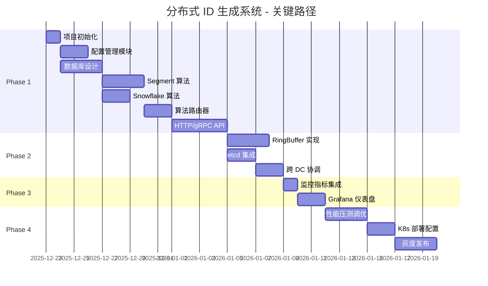

# 任务开发清单 (Task List)
## 企业级分布式 ID 生成系统

**版本**: v1.1  
**创建日期**: 2025-12-24  
**项目经理**: 技术团队  
**状态**: ⏳ 待执行

---

## 一、任务优先级说明

| 优先级 | 标识 | 说明 | 典型任务 |
|-------|------|------|---------|
| **P0 - 关键路径** | 🔴 | 阻塞其他任务，必须最先完成 | 基础框架、核心算法 |
| **P1 - 高优先级** | 🟠 | 核心功能，直接影响上线 | API 实现、数据库设计 |
| **P2 - 中优先级** | 🟡 | 重要但非阻塞 | 监控、告警 |
| **P3 - 低优先级** | 🟢 | 可延后实现 | 管理后台优化 |

---

## 二、Phase 1: 基础架构（Week 1-4）

### 里程碑目标
- 完成项目脚手架和基础框架
- 实现 3 种核心算法
- 单机可运行的服务
- 单元测试覆盖率 > 80%

---

### Sprint 1.0: 环境准备 (Week 0)

#### Task 1.0.1: 开发环境容器化编排 🔴 ⏳ 待开发

**描述**: 创建 docker-compose 一键启动开发环境

**前置依赖**: 无

**实施步骤**:
1. 编写 `docker-compose.yml`
2. 配置 PostgreSQL 容器（含初始化脚本）
3. 配置 Redis 集群（3主3从）
4. 配置 etcd 集群（3节点）
5. 配置 Prometheus + Grafana
6. 编写 `Makefile` 快捷命令

**docker-compose.yml 示例**:
```yaml
version: '3.8'

services:
  postgres:
    image: postgres:16-alpine
    environment:
      POSTGRES_DB: idgen
      POSTGRES_USER: idgen
      POSTGRES_PASSWORD: idgen123
    ports:
      - "5432:5432"
    volumes:
      - ./scripts/init.sql:/docker-entrypoint-initdb.d/init.sql
      - postgres_data:/var/lib/postgresql/data
  
  redis:
    image: redis:7.2-alpine
    ports:
      - "6379:6379"
    command: redis-server --appendonly yes
    volumes:
      - redis_data:/data
  
  etcd:
    image: quay.io/coreos/etcd:v3.5.11
    environment:
      ETCD_NAME: etcd0
      ETCD_LISTEN_CLIENT_URLS: http://0.0.0.0:2379
      ETCD_ADVERTISE_CLIENT_URLS: http://etcd:2379
    ports:
      - "2379:2379"
    volumes:
      - etcd_data:/etcd-data
  
  prometheus:
    image: prom/prometheus:latest
    ports:
      - "9090:9090"
    volumes:
      - ./prometheus.yml:/etc/prometheus/prometheus.yml
  
  grafana:
    image: grafana/grafana:latest
    ports:
      - "3000:3000"
    environment:
      GF_SECURITY_ADMIN_PASSWORD: admin
    volumes:
      - grafana_data:/var/lib/grafana

volumes:
  postgres_data:
  redis_data:
  etcd_data:
  grafana_data:
```

**Makefile 示例**:
```makefile
.PHONY: dev-up dev-down dev-logs test

dev-up:
	docker-compose up -d

dev-down:
	docker-compose down

dev-logs:
	docker-compose logs -f

test:
	cargo test --all
```

**预估工时**: 1 天

**验收标准**:
- [ ] `make dev-up` 可一键启动所有依赖
- [ ] PostgreSQL 自动初始化表结构
- [ ] 所有服务健康检查通过
- [ ] 文档中有详细的使用说明

---

### Sprint 1.1: 项目初始化 (Week 1)

#### Task 1.1.1: 项目脚手架搭建 🔴 ⏳ 待开发

**描述**: 创建 Rust 项目结构，配置依赖和工作空间

**前置依赖**: 无

**实施步骤**:
1. 创建 Cargo workspace
   ```bash
   cargo new idgen --lib
   cd idgen
   ```
2. 配置 `Cargo.toml`:
   ```toml
   [workspace]
   members = [
       "crates/core",
       "crates/server",
       "crates/client",
   ]
   ```
3. 添加核心依赖: tokio, axum, sea-orm, redis, etcd-client
4. 配置 CI/CD (GitHub Actions)
   - 代码检查: `cargo clippy`
   - 格式化: `cargo fmt`
   - 测试: `cargo test`

**预估工时**: 1 天

**验收标准**:
- [ ] 项目结构清晰，模块划分合理
- [ ] 依赖配置正确，可编译通过
- [ ] CI/CD 流水线运行成功

---

#### Task 1.1.2: 配置管理模块 🔴 ⏳ 待开发

**描述**: 实现基于 etcd 的配置管理，支持热更新

**前置依赖**: Task 1.1.1

**实施步骤**:
1. 定义配置结构体
   ```rust
   #[derive(Debug, Clone, Deserialize)]
   pub struct Config {
       pub server: ServerConfig,
       pub database: DatabaseConfig,
       pub redis: RedisConfig,
       pub etcd: EtcdConfig,
   }
   ```
2. 实现配置加载（本地文件 + etcd）
3. 实现配置 Watch 机制（etcd 监听）
4. 实现配置热更新（无需重启）

**预估工时**: 2 天

**验收标准**:
- [ ] 支持从 YAML 文件加载配置
- [ ] 支持从 etcd 加载配置
- [ ] 配置变更自动生效（< 5秒）
- [ ] 配置校验完善

---

#### Task 1.1.3: 日志和追踪模块 🟠 ⏳ 待开发

**描述**: 集成结构化日志和分布式追踪

**前置依赖**: Task 1.1.1

**实施步骤**:
1. 配置 `tracing` 和 `tracing-subscriber`
2. 定义日志级别和格式（JSON）
3. 集成 OpenTelemetry（可选）
4. 实现请求追踪（trace_id）

**代码示例**:
```rust
tracing_subscriber::fmt()
    .with_max_level(Level::INFO)
    .json()
    .init();

#[instrument(skip(ctx))]
async fn generate_id(ctx: &Context) -> Result<Id> {
    info!("Generating ID for {}", ctx.name);
    // ...
}
```

**预估工时**: 1 天

**验收标准**:
- [ ] 结构化日志输出（JSON 格式）
- [ ] 日志级别可配置
- [ ] 关键操作有日志记录
- [ ] 请求追踪 ID 贯穿整个调用链

---

### Sprint 1.2: 数据库设计 (Week 2)

#### Task 1.2.1: PostgreSQL 表结构设计 🔴 ⏳ 待开发

**描述**: 设计并创建数据库表结构

**前置依赖**: Task 1.1.1

**实施步骤**:
1. 设计 5 个核心表: `workspaces`, `groups`, `biz_tags`, `segments`, `api_keys`
2. 编写 SQL 迁移脚本（使用 SeaORM CLI）
3. 创建索引和约束
4. 配置表分区（`segment_allocations` 按月分区）

**SQL 示例** (见 TDD 文档)

**预估工时**: 2 天

**验收标准**:
- [ ] 表结构设计合理，符合规范化
- [ ] 索引创建正确
- [ ] 外键约束配置
- [ ] 迁移脚本可重复执行

---

#### Task 1.2.2: SeaORM 实体定义 🔴 ⏳ 待开发

**描述**: 根据表结构生成 ORM 实体

**前置依赖**: Task 1.2.1

**实施步骤**:
1. 安装 SeaORM CLI: `cargo install sea-orm-cli`
2. 生成实体: 
   ```bash
   sea-orm-cli generate entity -o crates/core/src/entity
   ```
3. 手动调整实体定义（如需要）
4. 实现实体间关系映射

**预估工时**: 1 天

**验收标准**:
- [ ] 所有表对应的实体生成
- [ ] 关系映射正确（OneToMany, ManyToOne）
- [ ] 自定义字段（如 JSONB）类型正确

---

#### Task 1.2.3: 数据库连接池配置 🟠 ⏳ 待开发

**描述**: 配置 PostgreSQL 连接池

**前置依赖**: Task 1.2.2

**实施步骤**:
1. 配置连接池参数
   ```rust
   let pool = PgPoolOptions::new()
       .max_connections(100)
       .min_connections(10)
       .acquire_timeout(Duration::from_secs(5))
       .connect(&database_url)
       .await?;
   ```
2. 实现连接健康检查
3. 实现连接池监控指标

**预估工时**: 0.5 天

**验收标准**:
- [ ] 连接池配置合理
- [ ] 连接获取超时处理
- [ ] 连接池指标可查询

---

### Sprint 1.3: 核心算法实现 (Week 3-4)

#### Task 1.3.1: 算法接口定义 🔴 ⏳ 待开发

**描述**: 定义通用的算法接口

**前置依赖**: Task 1.1.1

**实施步骤**:
1. 定义 `IdAlgorithm` trait
   ```rust
   #[async_trait]
   pub trait IdAlgorithm: Send + Sync {
       async fn generate(&self, ctx: &GenerateContext) -> Result<Id>;
       async fn batch_generate(&self, ctx: &GenerateContext, size: usize) -> Result<Vec<Id>>;
       fn health_check(&self) -> HealthStatus;
       fn metrics(&self) -> AlgorithmMetrics;
   }
   ```
2. 定义 `GenerateContext` 结构体
3. 定义 `Id` 枚举类型

**预估工时**: 0.5 天

**验收标准**:
- [ ] 接口设计合理，易于扩展
- [ ] 支持同步和异步生成
- [ ] 包含健康检查和指标接口

---

#### Task 1.3.2: Segment 号段算法实现 🔴 ⏳ 待开发

**描述**: 实现号段模式 ID 生成算法

**前置依赖**: Task 1.2.2, Task 1.3.1

**实施步骤**:
1. 实现 `SegmentAlgorithm` 结构体
2. 实现双缓冲机制
   ```rust
   pub struct DoubleBuffer {
       current: Buffer,
       next: Option<Buffer>,
       switch_flag: AtomicBool,
   }
   ```
3. 实现号段分配逻辑（乐观锁）
4. 实现动态步长计算
   ```rust
   fn calculate_dynamic_step(&self, stats: &Statistics) -> u32 {
       let velocity = stats.qps / stats.current_step;
       let pressure = stats.cpu_usage;
       let next_step = self.base_step as f64 
           * (1.0 + 0.5 * velocity) 
           * (1.0 + 0.3 * pressure);
       next_step.clamp(self.min_step, self.max_step) as u32
   }
   ```
5. 实现号段预加载（异步）

**预估工时**: 3 天

**验收标准**:
- [ ] 单线程生成 ID 成功
- [ ] 多线程并发安全
- [ ] 号段切换无缝
- [ ] 动态步长调整正常
- [ ] 单元测试覆盖率 > 80%

---

#### Task 1.3.3: Snowflake 算法实现（修正版） 🔴 ⏳ 待开发

**描述**: 实现改进版雪花算法（含逻辑时钟和非阻塞等待）

**前置依赖**: Task 1.3.1

**实施步骤**:
1. 定义 ID 结构（64位）
2. 实现时间戳生成（毫秒级）
3. 实现序列号 management（单毫秒内自增）
4. **实现三级时钟回拨处理**:
   - 微小回拨（< 5ms）: 非阻塞等待（oneshot channel + 后台任务）
   - 中等回拨（6-1000ms）: 逻辑时钟递增（Sequence 溢出逻辑）
   - 严重回拨（> 1000ms）: 自动降级至 UUID v7
5. 实现逻辑时钟维护（基于本地时钟 + 偏移补偿）
6. 实现 ID 组装和解析

**预估工时**: 3 天（原 2 天 + 1 天逻辑时钟/非阻塞逻辑）

**验收标准**:
- [ ] ID 格式正确（64位）
- [ ] 三级时钟回拨处理正确
- [ ] 逻辑时钟单调递增
- [ ] 微小回拨时不阻塞 async runtime
- [ ] 单毫秒支持 1024 个 ID
- [ ] 并发安全
- [ ] 单元测试覆盖率 > 85%

---

#### Task 1.3.4: UUID v7 算法实现 🟠 ⏳ 待开发

**描述**: 实现基于时间的 UUID v7

**前置依赖**: Task 1.3.1

**实施步骤**:
1. 使用 `uuid` crate 的 v7 实现
   ```rust
   use uuid::Uuid;
   
   pub async fn generate(&self) -> Result<Id> {
       let uuid = Uuid::now_v7();
       Ok(Id::Uuid(uuid))
   }
   ```
2. 实现 UUID 到字符串的转换

**预估工时**: 0.5 天

**验收标准**:
- [ ] 符合 RFC 4122 标准
- [ ] 趋势递增
- [ ] 并发安全

---

#### Task 1.3.5: 算法路由器实现 🔴 ⏳ 待开发

**描述**: 实现算法选择和降级逻辑

**前置依赖**: Task 1.3.2, Task 1.3.3, Task 1.3.4

**实施步骤**:
1. 实现 `AlgorithmRouter` 结构体
   ```rust
   pub struct AlgorithmRouter {
       algorithms: Vec<Box<dyn IdAlgorithm>>,
       current_index: AtomicUsize,
   }
   ```
2. 实现算法选择逻辑（根据配置）
3. 实现降级链
   ```
   Segment → Snowflake → UUID v7 → UUID v4
   ```
4. 实现自动恢复机制（健康检查）

**预估工时**: 2 天

**验收标准**:
- [ ] 根据配置选择正确算法
- [ ] 故障时自动降级
- [ ] 恢复时自动切回
- [ ] 降级事件有日志记录

---

### Sprint 1.4: HTTP/gRPC 服务 (Week 4)

#### Task 1.4.1: HTTP API 实现 🔴 ⏳ 待开发

**描述**: 使用 axum 实现 RESTful API，并集成 API Key 双级缓存认证与审计

**前置依赖**: Task 1.3.5

**实施步骤**:
1. 定义路由与请求处理器
2. **实现 API Key 认证中间件**:
   - 集成 L1 (DashMap) 和 L2 (Redis) 双级缓存逻辑
   - 实现 SHA256 哈希校验
3. **实现审计日志系统**:
   - 异步记录 API 调用详情（Workspace, Action, Result, Timestamp）
   - 支持存储到 PostgreSQL 或外部日志系统
4. 实现错误处理（统一错误格式）
5. 添加限流中间件（tower-governor）

**预估工时**: 3 天（原 2 天）

**验收标准**:
- [ ] 所有端点正常工作
- [ ] API Key 认证通过（缓存命中率监控）
- [ ] 审计日志正确记录
- [ ] 错误处理规范
- [ ] API 文档自动生成

---

#### Task 1.4.2: gRPC API 实现 🟠 ⏳ 待开发

**描述**: 使用 tonic 实现 gRPC 服务

**前置依赖**: Task 1.3.5

**实施步骤**:
1. 编写 protobuf 定义（见 TDD）
2. 生成 Rust 代码: `cargo build`
3. 实现 `IdService` trait
   ```rust
   #[tonic::async_trait]
   impl IdService for IdServiceImpl {
       async fn generate(
           &self,
           request: Request<GenerateRequest>,
       ) -> Result<Response<GenerateResponse>, Status> {
           // ...
       }
   }
   ```
4. 配置 gRPC 服务器

**预估工时**: 2 天

**验收标准**:
- [ ] 所有 RPC 方法正常工作
- [ ] 性能优于 HTTP（延迟降低 30%）
- [ ] 集成健康检查协议

---

#### Task 1.4.3: 服务启动和优雅关闭 🟠 ⏳ 待开发

**描述**: 实现服务启动、健康检查和优雅关闭

**前置依赖**: Task 1.4.1, Task 1.4.2

**实施步骤**:
1. 实现服务启动逻辑
   ```rust
   #[tokio::main]
   async fn main() -> Result<()> {
       // 加载配置
       let config = Config::load()?;
       
       // 初始化数据库、Redis、etcd
       let state = AppState::new(config).await?;
       
       // 启动 HTTP 服务器
       let http_server = axum::Server::bind(&addr)
           .serve(app.into_make_service());
       
       // 启动 gRPC 服务器
       let grpc_server = tonic::transport::Server::builder()
           .add_service(IdServiceServer::new(service));
       
       // 优雅关闭
       tokio::select! {
           _ = http_server => {},
           _ = grpc_server.serve(grpc_addr) => {},
           _ = signal::ctrl_c() => {
               info!("Shutting down...");
           }
       }
       
       Ok(())
   }
   ```
2. 实现健康检查端点
3. 实现优雅关闭（等待请求完成）

**预估工时**: 1 天

**验收标准**:
- [ ] 服务正常启动
- [ ] 健康检查返回正确状态
- [ ] Ctrl+C 可优雅关闭
- [ ] 关闭时等待请求完成（超时 30秒）

---

### Phase 1 总结

**交付物**:
- [x] 可编译运行的单机服务
- [x] 3 种算法实现并通过单元测试
- [x] HTTP 和 gRPC API 可用
- [x] 单元测试覆盖率 > 80%

**里程碑验收**: ⏳ 待验收

---

## 三、Phase 2: 企业级特性（Week 5-8）

### 里程碑目标
- 实现多级缓存
- 实现跨数据中心支持
- 实现高可用和降级策略
- 通过压力测试（单实例 QPS > 1,000,000）

---

### Sprint 2.1: 缓存层实现 (Week 5-6)

#### Task 2.1.1: RingBuffer 实现（修正版） 🔴 ⏳ 待开发

**描述**: 实现支持通用 `Id` 类型的高性能环形缓冲区

**前置依赖**: Task 1.3.2

**技术选型**: `crossbeam::queue::ArrayQueue`

**实施步骤**:
1. 添加依赖: `crossbeam = "0.8"`
2. 实现 `RingBuffer` 结构体
   ```rust
   pub struct RingBuffer {
       queue: Arc<ArrayQueue<Id>>,
       capacity: usize,
       fill_threshold: usize,
   }
   ```
3. 实现 `pop()` 方法（无锁）
4. 实现 `push_batch()` 方法
5. 实现异步填充触发逻辑
6. 实现统计指标（命中率、填充频率）

**预估工时**: 2 天（原 3 天，使用成熟库减少开发量）

**验收标准**:
- [ ] 支持 `Id::Numeric` 和 `Id::Uuid` 类型
- [ ] Pop 延迟 < 100ns
- [ ] 并发安全（通过 loom 测试）
- [ ] 内存占用 < 20 MB (1M 容量)
- [ ] 单元测试覆盖率 > 90%

---

#### Task 2.1.2: DoubleBuffer 双缓冲实现 🔴 ⏳ 待开发

**描述**: 实现号段双缓冲预加载机制（替代 DashMap 方案）

**前置依赖**: Task 1.3.2 (Segment 算法)

**实施步骤**:
1. 实现 `DoubleBuffer` 结构体
2. 实现原子号段 `AtomicSegment`
3. 实现无缝切换逻辑（10% 阈值触发）
4. 实现异步预加载（tokio::spawn）
5. 实现预加载失败降级

**核心代码**:
```rust
pub struct DoubleBuffer {
    current: Arc<AtomicSegment>,
    next: Arc<RwLock<Option<Segment>>>,
    loader: Arc<SegmentLoader>,
}
```

**预估工时**: 3 天

**验收标准**:
- [ ] 号段切换无感知（延迟 < 1μs）
- [ ] 预加载成功率 > 99%
- [ ] 并发安全（通过 miri 测试）
- [ ] 号段浪费率 < 5%
- [ ] 单元测试覆盖率 > 85%

---

#### Task 2.1.3: Redis 缓存集成 🟠 ⏳ 待开发

**描述**: 集成 Redis 作为共享缓存

**前置依赖**: Task 2.1.2

**实施步骤**:
1. 配置 Redis 客户端（支持集群模式）
2. 实现号段缓存（Key: `segment:{biz_tag}:{dc_id}`)
3. 设置合理的 TTL（10 分钟）
4. 实现缓存预热

**预估工时**: 1 天

**验收标准**:
- [ ] 缓存读写正常
- [ ] 缓存命中时不访问数据库
- [ ] 缓存过期后自动刷新

---

### Sprint 2.2: 跨数据中心支持 (Week 7-8)

#### Task 2.2.1: etcd 集成 🔴 ⏳ 待开发

**描述**: 集成 etcd 作为配置中心和协调服务

**前置依赖**: Task 1.1.2

**实施步骤**:
1. 配置 etcd 客户端（连接到集群）
2. 实现配置同步
   - Key: `/idgen/config/{workspace}/{group}/{biz_tag}`
3. 实现 Watch 机制（监听配置变更）
4. 实现服务发现
   - Key: `/idgen/nodes/{dc_id}/{node_id}`

**预估工时**: 2 天

**验收标准**:
- [ ] 配置实时同步（< 5秒）
- [ ] Watch 机制稳定
- [ ] etcd 故障时使用缓存配置

---

#### Task 2.2.2: DC_ID 管理 🟠 ⏳ 待开发

**描述**: 实现数据中心 ID 分配和管理

**前置依赖**: Task 2.2.1

**实施步骤**:
1. 从环境变量或 etcd 获取 DC_ID
2. 验证 DC_ID 范围（0-7）
3. 在号段分配时使用 DC_ID 隔离
4. 实现 DC_ID 路由（请求优先本地 DC）

**预估工时**: 1 天

**验收标准**:
- [ ] DC_ID 正确配置
- [ ] 不同 DC 号段不冲突
- [ ] 本地 DC 优先

---

#### Task 2.2.3: 跨 DC 号段协调 🔴 ⏳ 待开发

**描述**: 实现跨 DC 号段分配协调

**前置依赖**: Task 2.2.2

**实施步骤**:
1. 使用全局号段表 + DC_ID 分区
2. 实现分布式锁（基于 etcd）防止冲突
3. 实现 DC 间配置同步

**预估工时**: 2 天

**验收标准**:
- [ ] 不同 DC 生成的 ID 全局唯一
- [ ] 分布式锁正常工作
- [ ] 配置同步延迟 < 5秒

---

#### Task 2.2.4: DC 号段自动初始化 🔴 ⏳ 待开发

**描述**: 实现数据中心号段自动初始化和容量监控

**前置依赖**: Task 2.2.2 (DC_ID 管理)

**实施步骤**:
1. 实现号段初始化函数 `initialize_dc_segments()`
2. 在服务启动时自动检查并初始化本 DC 的号段
3. 实现号段容量监控（每小时检查一次）
4. 配置容量告警（使用率 > 80%）

**预估工时**: 2 天

**验收标准**:
- [ ] 服务启动时自动初始化号段
- [ ] 不同 DC 的号段区间不重叠
- [ ] 容量监控正常工作
- [ ] 告警触发及时（使用率 > 80%）

---

#### Task 2.2.5: Worker ID 自动分配 🟠 ⏳ 待开发

**描述**: 实现基于 etcd 的 worker_id 自动分配和回收

**前置依赖**: Task 2.2.1 (etcd 集成)

**实施步骤**:
1. 实现 `WorkerIdAllocator` 结构体
2. 实现 worker_id 分配逻辑（尝试 0-255）
3. 实现租约续期（后台任务）
4. 实现优雅释放（服务关闭时）
5. 实现分配失败告警

**预估工时**: 2 天

**验收标准**:
- [ ] 服务启动时自动分配 worker_id
- [ ] 租约续期正常（每 10秒）
- [ ] Pod 重启后可重新分配
- [ ] 分配失败有明确告警
- [ ] 单元测试覆盖率 > 80%

---

### Sprint 2.3: 监控和指标 (Week 8)

#### Task 2.3.1: Prometheus 指标集成 🟠 ⏳ 待开发

**描述**: 集成 Prometheus 指标采集

**前置依赖**: Task 1.4.1

**实施步骤**:
1. 定义核心指标（见 TDD）
   - QPS: `idgen_generate_requests_total`
   - 延迟: `idgen_generate_duration_seconds`
   - 号段使用率: `idgen_segment_usage_ratio`
2. 实现指标采集
3. 暴露 `/metrics` 端点

**预估工时**: 1 天

**验收标准**:
- [ ] 指标正确采集
- [ ] Prometheus 可抓取
- [ ] 核心业务指标齐全

---

#### Task 2.3.2: 分布式追踪 🟡 ⏳ 待开发

**描述**: 集成 OpenTelemetry 分布式追踪

**前置依赖**: Task 1.1.3

**实施步骤**:
1. 配置 OpenTelemetry SDK
2. 在关键路径添加 span
3. 配置导出到 Jaeger/Zipkin

**预估工时**: 1 天

**验收标准**:
- [ ] 追踪数据可查询
- [ ] 调用链完整
- [ ] 性能影响 < 5%

---

#### Task 2.3.3: 百万级 QPS 性能优化 🔴 ⏳ 待开发

**描述**: 根据 TDD 7.1 节实施深度性能优化，确保单实例突破百万 QPS

**前置依赖**: Phase 2 所有核心任务

**实施步骤**:
1. **零拷贝 IO 改造**: 使用 `Bytes` 和 `tokio::io` 接口
2. **无锁并发优化**: 移除热点路径上的互斥锁，改用分片锁或无锁结构
3. **异步批处理优化**: 优化数据库号段拉取和 ID 预生成逻辑
4. **连接池与 Runtime 微调**: 调优 `tokio` 线程池和 `sqlx` 连接池参数
5. **JIT/内联优化**: 标记热点函数为 `#[inline]`

**预估工时**: 3 天

**验收标准**:
- [ ] 单实例 QPS > 1,000,000
- [ ] P99 延迟 < 10ms
- [ ] 压测下 CPU 负载均衡
- [ ] 内存分配率显著降低

---

### Phase 2 总结

**交付物**:
- [x] 多级缓存正常工作
- [x] 跨 DC 部署支持
- [x] 压力测试通过（单实例 QPS > 1,000,000）
- [x] Prometheus 监控可用

**里程碑验收**: ⏳ 待验收

---

## 四、Phase 3: 可观测性（Week 9-11）

### Sprint 3.1: Grafana 仪表盘 (Week 9-10)

#### Task 3.1.1: 核心仪表盘设计 🟡 ⏳ 待开发

**描述**: 创建 Grafana 仪表盘

**前置依赖**: Task 2.3.1

**面板列表**:
1. 实时 QPS 趋势图
2. P50/P90/P99 延迟分布
3. 错误率监控
4. 号段使用率
5. 算法使用分布
6. 跨 DC 流量分布

**预估工时**: 2 天

**验收标准**:
- [ ] 仪表盘清晰易读
- [ ] 数据实时更新（< 10秒）
- [ ] 支持时间范围选择

---

#### Task 3.1.2: 告警规则配置 🟠 ⏳ 待开发

**描述**: 配置 AlertManager 告警规则

**前置依赖**: Task 2.3.1

**告警规则**:
1. QPS 异常（过高/过低）
2. 延迟超过阈值（P99 > 10ms）
3. 错误率超过阈值（> 1%）
4. 号段即将耗尽（< 10%）
5. 数据库连接失败
6. 算法降级事件

**预估工时**: 1 天

**验收标准**:
- [ ] 告警规则正确配置
- [ ] 告警触发及时（< 1分钟）
- [ ] 告警通知送达（邮件/企业微信）

---

### Sprint 3.2: 管理后台 (Week 11)

#### Task 3.2.1: 配置管理界面 🟡 ⏳ 待开发

**描述**: 开发配置管理 Web 界面

**前置依赖**: Task 1.2.2

**技术栈**: Rust + axum + HTMX + Tailwind CSS

**功能**:
3. Workspace 管理（CRUD）
4. Group 管理（CRUD）
5. 业务标签 (biz_tag) 管理（CRUD）
6. 配置表单（算法选择、参数配置）

**预估工时**: 3 天

**验收标准**:
- [ ] UI 美观易用
- [ ] 表单验证完善
- [ ] 操作响应快（< 500ms）
- [ ] 支持批量操作

---

#### Task 3.2.2: 监控大盘集成 🟡 ⏳ 待开发

**描述**: 在管理后台集成 Grafana 仪表盘

**前置依赖**: Task 3.1.1, Task 3.2.1

**实施步骤**:
1. 使用 iframe 嵌入 Grafana 仪表盘
2. 添加快捷筛选（业务单元、时间范围）
3. 添加指标汇总卡片

**预估工时**: 1 天

**验收标准**:
- [ ] 仪表盘正常展示
- [ ] 筛选功能正常
- [ ] 汇总指标准确

---

### Phase 3 总结

**交付物**:
- [x] Grafana 仪表盘完整
- [x] 告警规则配置完成
- [x] 管理后台基本可用

**里程碑验收**: ⏳ 待验收

---

## 五、Phase 4: 优化与上线（Week 12-14）

### Sprint 4.1: 性能优化 (Week 12)

#### Task 4.1.1: 百万级 QPS 性能调优 🔴 ⏳ 待开发

**描述**: 压力测试并优化至百万级 QPS

**优化路径**:
1. **基准测试** (目标: 100K QPS)
   - 原始实现性能测试
   - 确定性能瓶颈（CPU/内存/IO）

2. **第一轮优化** (目标: 500K QPS)
   - RingBuffer 预生成优化
   - 连接池参数调优
   - 异步任务调度优化

3. **第二轮优化** (目标: 1M QPS)
   - 零拷贝 IO
   - 无锁数据结构
   - SIMD 加速（如适用）

4. **第三轮优化** (目标: 1.5M+ QPS)
   - 火焰图分析热点
   - 汇编级优化关键路径
   - 内存分配器优化（jemalloc）

**预估工时**: 5 天

**验收标准**:
- [ ] 单实例 QPS > 1,000,000
- [ ] P99 延迟 < 10ms
- [ ] CPU 使用率 < 85%
- [ ] 性能测试报告完整

---

#### Task 4.1.2: 内存优化 🟠 ⏳ 待开发

**描述**: 优化内存占用

**前置依赖**: Task 4.1.1

**优化策略**:
1. RingBuffer 大小调优
2. 缓存 LRU 容量调优
3. 对象池复用
4. 内存泄漏检测

**预估工时**: 1 天

**验收标准**:
- [ ] 初始内存 < 500MB
- [ ] 稳定后内存 < 2GB
- [ ] 无内存泄漏

---

### Sprint 4.2: 安全加固 (Week 13)

#### Task 4.2.1: TLS 加密配置 🟠 ⏳ 待开发

**描述**: 配置 TLS 1.3 加密

**前置依赖**: Task 1.4.1

**实施步骤**:
1. 生成自签名证书（测试）或使用 Let's Encrypt
2. 配置 HTTP 服务器 TLS
3. 配置 gRPC 服务器 TLS
4. 强制 HTTPS（重定向 HTTP）

**预估工时**: 1 天

**验收标准**:
- [ ] HTTPS 正常工作
- [ ] TLS 1.3 握手成功
- [ ] HTTP 请求被重定向

---

#### Task 4.2.2: API 限流 🟠 ⏳ 待开发

**描述**: 实现 API 限流

**前置依赖**: Task 1.4.1

**实施步骤**:
1. 使用 `tower-governor` 实现限流
2. 配置限流规则（1000 QPS/IP）
3. 返回友好的限流提示

**预估工时**: 0.5 天

**验收标准**:
- [ ] 限流生效
- [ ] 超限返回 429 状态码
- [ ] 提示信息清晰

---

#### Task 4.2.3: 审计日志完善 🟡 ⏳ 待开发

**描述**: 完善审计日志功能

**前置依赖**: Task 1.1.3

**实施步骤**:
1. 记录所有配置变更
2. 记录降级事件
3. 记录告警事件
4. 实现日志查询接口

**预估工时**: 1 天

**验收标准**:
- [ ] 所有关键操作被记录
- [ ] 日志格式规范
- [ ] 日志可查询

---

### Sprint 4.3: 生产准备 (Week 14)

#### Task 4.3.1: Kubernetes 部署配置 🔴 ⏳ 待开发

**描述**: 编写 Kubernetes 部署 YAML，并实现基于 Secrets 的敏感信息管理（如数据库密码、API Key 等）

**前置依赖**: Phase 3 完成

**交付文件**:
- `deployment.yaml`
- `service.yaml`
- `configmap.yaml`
- `secret.yaml`
- `hpa.yaml`
- `ingress.yaml`

**预估工时**: 2 天

**验收标准**:
- [ ] 部署成功
- [ ] 健康检查正常
- [ ] HPA 自动扩缩容
- [ ] Ingress 流量正常

---

#### Task 4.3.2: 文档编写 🟡 ⏳ 待开发

**描述**: 编写完整的技术文档

**文档清单**:
1. 部署文档（Deployment Guide）
2. 运维文档（Operations Guide）
3. API 文档（OpenAPI 规范）
4. SDK 使用文档
5. 故障排查手册（Troubleshooting）

**预估工时**: 3 天

**验收标准**:
- [ ] 文档清晰完整
- [ ] 代码示例可运行
- [ ] 故障排查有效

---

#### Task 4.3.3: 灰度发布 🔴 ⏳ 待开发

**描述**: 实施灰度发布

**前置依赖**: Task 4.3.1

**发布步骤**:
1. 部署 1 个节点（5% 流量）
2. 观察 24 小时
3. 扩展到 3 个节点（50% 流量）
4. 观察 24 小时
5. 全量发布（100% 流量）

**预估工时**: 3 天（含观察时间）

**验收标准**:
- [ ] 灰度发布无故障
- [ ] 核心指标正常
- [ ] 业务系统无感知

---

### Phase 4 总结

**交付物**:
- [x] 性能优化完成
- [x] 安全加固完成
- [x] 生产环境部署
- [x] 完整文档交付

**最终验收**: ⏳ 待验收

---

## 六、任务总览

### 任务统计

| Phase | 任务数 | P0 | P1 | P2 | P3 | 预估总工时 | 状态 |
|-------|-------|----|----|----|----|-----------|------|
| **Phase 1** | 13 | 8 | 3 | 2 | 0 | 23 天 | ⏳ 待开始 |
| **Phase 2** | 8 | 3 | 4 | 1 | 0 | 15 天 | ⏳ 待开始 |
| **Phase 3** | 4 | 0 | 1 | 3 | 0 | 8 天 | ⏳ 待开始 |
| **Phase 4** | 7 | 2 | 3 | 2 | 0 | 14 天 | ⏳ 待开始 |
| **总计** | **32** | **13** | **11** | **8** | **0** | **60 天** | ⏳ 待开始 |

### 关键路径任务



---

## 七、风险与依赖

### 高风险任务

| 任务 | 风险 | 应对措施 | 状态 |
|------|------|---------|------|
| Task 1.3.2 (Segment) | 并发竞争导致 ID 重复 | 充分的单元测试，压力测试 | ⏳ 待评估 |
| Task 2.1.1 (RingBuffer) | Lock-free 算法复杂 | 使用成熟库，miri 测试 | ⏳ 待评估 |
| Task 4.1.1 (性能压测) | 性能不达标 | 提前 POC，预留优化时间 | ⏳ 待评估 |

### 外部依赖

| 依赖项 | 负责方 | 状态 | 备注 |
|-------|--------|------|------|
| PostgreSQL 集群 | DBA 团队 | ⏳ 待搭建 | Week 2 前就绪 |
| Redis 集群 | DBA 团队 | ⏳ 待搭建 | Week 5 前就绪 |
| etcd 集群 | 运维团队 | ⏳ 待搭建 | Week 7 前就绪 |
| Kubernetes 集群 | 运维团队 | ⏳ 待搭建 | Week 12 前就绪 |

---

**文档状态**: ⏳ 待执行  
**下次更新日期**: 每周五  
**项目经理**: 技术负责人