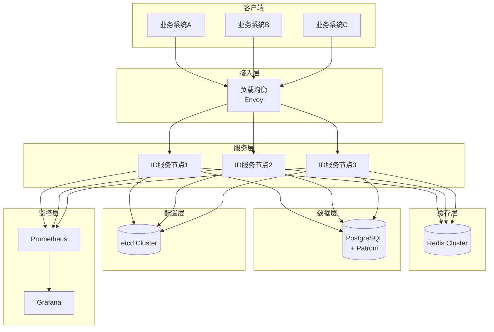
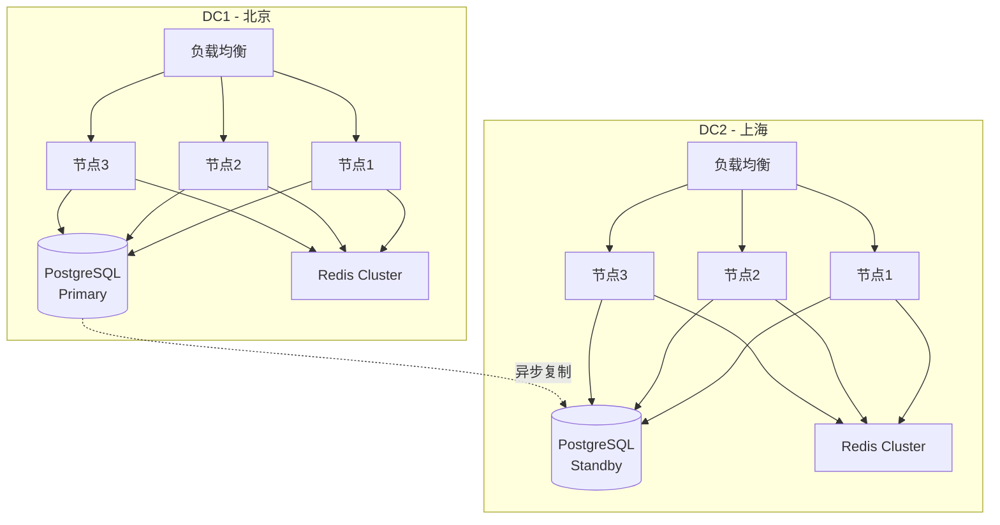

# 技术设计文档 (TDD)

## 企业级分布式 ID 生成系统

**版本**: v1.1 
**创建日期**: 2025-12-24  
**架构师**: 技术团队  
**状态**: ✅ 已修正 / ⏳ 待评审

---

## 一、系统架构设计

### 1.1 总体架构 ⏳ 待实现



### 1.2 服务内部架构 (修正版) ⏳ 待实现

引入了三级缓存架构（RingBuffer -> DoubleBuffer -> Storage）和 API Key 认证模块。

```mermaid
graph LR
    subgraph "API 层"
        HTTP[HTTP Server<br/>axum]
        GRPC[gRPC Server<br/>tonic]
        AUTH[API Key Auth]
    end
    
    subgraph "业务逻辑层"
        ROUTER[算法路由器]
        SEG[Segment 引擎]
        SNOW[Snowflake 引擎]
        UUID[UUID v7 引擎]
    end
    
    subgraph "缓存层 (三级)"
        RING[L1: RingBuffer<br/>(ArrayQueue)]
        DOUBLE[L2: DoubleBuffer<br/>(AtomicSegment)]
    end
    
    subgraph "存储层"
        ORM[SeaORM]
        REDIS_CLI[Redis Client]
    end
    
    HTTP & GRPC --> AUTH
    AUTH --> ROUTER
    ROUTER --> SEG & SNOW & UUID
    SEG --> RING
    RING --> DOUBLE
    DOUBLE --> REDIS_CLI
    DOUBLE --> ORM
```

---

## 二、技术栈选型

### 2.1 核心技术栈 ⏳ 待实现

| 组件         | 技术选型   | 版本  | 选型理由                       |
| ------------ | ---------- | ----- | ------------------------------ |
| **编程语言** | Rust       | 1.75+ | 高性能、内存安全、零成本抽象   |
| **Web框架**  | axum       | 0.7   | 异步高性能、类型安全、生态完善 |
| **RPC框架**  | tonic      | 0.11  | gRPC for Rust，性能优秀        |
| **ORM**      | SeaORM     | 0.12  | 异步支持、类型安全、迁移管理   |
| **数据库**   | PostgreSQL | 16    | 强一致性、ACID、高级特性       |
| **缓存**     | Redis      | 7.2   | 高性能、集群支持、持久化       |
| **配置中心** | etcd       | 3.5   | 强一致性、Watch机制、高可用    |
| **监控**     | Prometheus | 2.50  | 时序数据库、丰富的查询语言     |
| **可视化**   | Grafana    | 10.0  | 仪表盘、告警、多数据源         |
| **容器编排** | Kubernetes | 1.28+ | 自动扩缩容、服务发现、健康检查 |

### 2.2 核心依赖库 ⏳ 待实现

新增 `crossbeam` 用于无锁队列，`sha2` 用于 API Key 哈希。

```toml
[dependencies]
# Web 框架
axum = "0.7"
tokio = { version = "1.35", features = ["full"] }
tower = "0.4"
tower-http = { version = "0.5", features = ["trace", "cors"] }

# gRPC
tonic = "0.11"
prost = "0.12"

# 数据库
sea-orm = { version = "0.12", features = ["sqlx-postgres", "runtime-tokio-native-tls"] }
sqlx = { version = "0.7", features = ["postgres", "runtime-tokio-native-tls"] }

# 缓存
redis = { version = "0.24", features = ["tokio-comp", "cluster"] }
moka = { version = "0.12", features = ["future"] }

# 配置
etcd-client = "0.13"
serde = { version = "1.0", features = ["derive"] }
config = "0.14"

# 监控
prometheus = "0.13"
tracing = "0.1"
tracing-subscriber = "0.3"

# 并发与工具
crossbeam = "0.8"       # 新增: 高性能并发原语
parking_lot = "0.12"
dashmap = "5.5"
uuid = { version = "1.6", features = ["v7"] }
chrono = "0.4"
thiserror = "1.0"
anyhow = "1.0"
sha2 = "0.10"           # 新增: API Key 哈希
```

---

## 三、核心模块设计

### 3.1 算法引擎模块 ⏳ 待实现

#### 3.1.1 算法特征抽象

```rust
#[derive(Debug, Clone)]
pub enum Id {
    Numeric(u64),
    Uuid(uuid::Uuid),
    Formatted(String), // 新增: 支持自定义格式化字符串
}

#[async_trait]
pub trait IdAlgorithm: Send + Sync {
    /// 生成单个 ID
    async fn generate(&self, ctx: &GenerateContext) -> Result<Id>;
    
    /// 批量生成 ID
    async fn batch_generate(&self, ctx: &GenerateContext, size: usize) -> Result<Vec<Id>>;
    
    /// 健康检查
    fn health_check(&self) -> HealthStatus;
    
    /// 获取指标
    fn metrics(&self) -> AlgorithmMetrics;
}

pub struct GenerateContext {
    pub workspace: String,
    pub group: String,
    pub biz_tag: String, 
    pub datacenter_id: u8,
    pub worker_id: u16,
    pub format_template: Option<String>, // 新增: 支持动态模板，如 "WB{YYYYMMDD}{SEQ}"
}
```

#### 3.1.2 Segment 号段算法 (DoubleBuffer) ⏳ 待实现

**核心数据结构**:
移除原有的 DashMap 方案，采用 `RingBuffer` + `DoubleBuffer` 架构。

```rust
pub struct SegmentAlgorithm {
    /// L1: RingBuffer 预生成池 (ArrayQueue)
    ring_buffer: Arc<RingBuffer>,
    /// L2: DoubleBuffer 双缓冲号段
    double_buffer: Arc<DoubleBuffer>,
    /// 配置
    config: SegmentConfig,
}

/// 双缓冲号段（Segment 算法核心）
pub struct DoubleBuffer {
    /// 当前正在使用的号段
    current: Arc<AtomicSegment>,
    
    /// 预加载的下一个号段
    next: Arc<RwLock<Option<Segment>>>,
    
    /// 切换标志位
    switch_threshold: f64,  // 默认 0.1 (10%)
    
    /// 异步加载任务
    loader: Arc<SegmentLoader>,
}

impl DoubleBuffer {
    /// 获取 ID（快速路径）
    pub fn get_id(&self) -> Option<u64> {
        let current = self.current.load();
        let position = current.position.fetch_add(1, Ordering::Relaxed);
        
        // 检查是否需要切换
        if self.should_switch(position, current.end) {
            self.switch_buffer();
        }
        
        if position < current.end {
            Some(position)
        } else {
            None
        }
    }
    
    /// 无缝切换号段
    fn switch_buffer(&self) {
        let mut next_lock = self.next.write().unwrap();
        if let Some(next_segment) = next_lock.take() {
            // 原子替换当前号段
            self.current.store(next_segment);
            
            // 立即触发新的预加载
            tokio::spawn(async move {
                self.loader.preload_next_segment().await;
            });
        }
    }
}

/// 原子号段（无锁并发安全）
pub struct AtomicSegment {
    start: u64,
    end: u64,
    position: AtomicU64,
    step: u32,
}
```

**动态步长计算公式**:

```
next_step = base_step × (1 + α × velocity) × (1 + β × pressure)

其中:
- velocity = current_qps / step
- pressure = cpu_usage (0-1)
- α = 0.5 (速率因子)
- β = 0.3 (压力因子)

边界控制:
- min_step = base_step × 0.5
- max_step = base_step × 100
```

#### 3.1.3 Snowflake 算法 (含时钟回拨处理) ⏳ 待实现

**ID 结构（64位）**:

```
┌─────┬──────────────┬───────────┬───────────┬──────────┐
│ 保留 │ 时间戳(42位) │ DC_ID(3位)│ 机器ID(8位)│ 序列号(10位) │
└─────┴──────────────┴───────────┴───────────┴──────────┘
  1bit      42bits        3bits       8bits       10bits
```

**三级时钟回拨处理 (非阻塞)**:

```rust
use tokio::sync::oneshot;
use std::collections::VecDeque;

pub struct SnowflakeAlgorithm {
    datacenter_id: u8,
    worker_id: u16,
    sequence: AtomicU16,
    last_timestamp: AtomicI64,
    
    /// 逻辑时钟（用于处理中等回拨）
    logical_clock: AtomicU64,
    
    /// 等待队列（用于微小回拨时的非阻塞等待）
    wait_queue: Arc<Mutex<VecDeque<oneshot::Sender<Id>>>>,
}

impl SnowflakeAlgorithm {
    pub async fn generate(&self) -> Result<Id> {
        let current_ts = Self::current_millis();
        let last_ts = self.last_timestamp.load(Ordering::Acquire);
        
        // 时钟回拨检测
        if current_ts < last_ts {
            let drift = last_ts - current_ts;
            
            match drift {
                // 1. 微小回拨 (<5ms): 加入等待队列，非阻塞
                0..=5 => {
                    let (tx, rx) = oneshot::channel();
                    self.wait_queue.lock().unwrap().push_back(tx);
                    // 异步等待，不阻塞 worker 线程
                    return rx.await.map_err(|_| Error::WaitQueueClosed);
                }
                
                // 2. 中等回拨 (6-1000ms): 使用逻辑时钟
                6..=1000 => {
                    // 逻辑时钟递增
                    let logical_ts = self.logical_clock.fetch_add(1, Ordering::SeqCst);
                    return self.compose_id_with_logical_clock(logical_ts);
                }
                
                // 3. 严重回拨 (>1000ms): 立即降级
                _ => {
                    return Err(Error::ClockBackward(drift));
                }
            }
        }
        
        // 正常生成逻辑
        let sequence = self.get_next_sequence(current_ts)?;
        let id = self.compose_id(current_ts, sequence)?;
        
        // 更新逻辑时钟（保持同步）
        self.logical_clock.store(current_ts as u64, Ordering::Release);
        
        Ok(id)
    }
    
    /// 后台时钟追赶任务
    async fn clock_catcher_task(self: Arc<Self>) {
        loop {
            tokio::time::sleep(Duration::from_millis(1)).await;
            let current_ts = Self::current_millis();
            let last_ts = self.last_timestamp.load(Ordering::Acquire);
            
            if current_ts >= last_ts {
                let mut queue = self.wait_queue.lock().unwrap();
                while let Some(tx) = queue.pop_front() {
                    if let Ok(id) = self.generate_normal(current_ts) {
                        let _ = tx.send(id);
                    }
                }
            }
        }
    }
}
```

#### 3.1.4 UUID v7 算法 ⏳ 待实现

```rust
pub struct UuidV7Algorithm {}

impl UuidV7Algorithm {
    /// 基于时间戳的 UUID，保证趋势递增
    async fn generate(&self) -> Result<Id> {
        let uuid = uuid::Uuid::now_v7();
        Ok(Id::Uuid(uuid))
    }
}
```

### 3.2 缓存层设计 (修正版) ⏳ 待实现

#### 3.2.1 三级缓存架构

```rust
pub struct CacheLayer {
    /// L1: RingBuffer 预生成池（快速路径，无锁队列）
    ring_buffer: Arc<RingBuffer>,
    
    /// L2: DoubleBuffer 双缓冲号段（Segment 算法专用）
    double_buffer: Arc<DoubleBuffer>,
    
    /// L3: Redis 共享缓存 + PostgreSQL 持久化
    storage: Arc<Storage>,
}
```

#### 3.2.2 RingBuffer 设计 (crossbeam::ArrayQueue)

使用 `crossbeam` 替代原有的 `Vec<AtomicU64>` 以支持通用 `Id` 类型并提升性能。

```rust
use crossbeam::queue::ArrayQueue;

pub struct RingBuffer {
    /// 使用 crossbeam 的无锁队列，支持通用 Id 类型
    queue: Arc<ArrayQueue<Id>>,
    
    /// 容量 (默认 1,000,000)
    capacity: usize,
    
    /// 填充阈值 (默认 10%)
    fill_threshold: usize,
}

impl RingBuffer {
    pub fn new(capacity: usize) -> Self {
        Self {
            queue: Arc::new(ArrayQueue::new(capacity)),
            capacity,
            fill_threshold: capacity / 10, 
        }
    }
    
    /// 获取 ID（O(1) 时间复杂度，< 50ns）
    pub fn pop(&self) -> Option<Id> {
        let id = self.queue.pop();
        
        // 检查是否需要异步填充
        if self.queue.len() < self.fill_threshold {
            self.trigger_async_fill();
        }
        
        id
    }
    
    /// 批量填充（由后台任务调用）
    pub fn push_batch(&self, ids: Vec<Id>) -> Result<usize> {
        let mut pushed = 0;
        for id in ids {
            if self.queue.push(id).is_ok() {
                pushed += 1;
            } else {
                break; // 队列已满
            }
        }
        Ok(pushed)
    }
}
```

### 3.3 降级策略模块 ⏳ 待实现

```rust
pub struct DegradationRouter {
    /// 算法优先级链
    algorithms: Vec<Box<dyn IdAlgorithm>>,
    /// 当前算法索引
    current_index: AtomicUsize,
    /// 降级记录器
    recorder: Arc<DegradationRecorder>,
}

impl DegradationRouter {
    pub async fn generate(&self, ctx: &GenerateContext) -> Result<Id> {
        let mut index = self.current_index.load(Ordering::Acquire);
        
        loop {
            if index >= self.algorithms.len() {
                return Err(Error::AllAlgorithmsFailed);
            }
            
            let algo = &self.algorithms[index];
            match algo.generate(ctx).await {
                Ok(id) => {
                    // 尝试恢复到更高优先级算法
                    self.try_recover().await;
                    return Ok(id);
                }
                Err(e) => {
                    // 记录降级事件
                    self.recorder.record_degradation(index, e).await;
                    // 切换到下一个算法
                    index += 1;
                    self.current_index.store(index, Ordering::Release);
                }
            }
        }
    }
}
```

---

## 四、数据模型设计

### 4.1 PostgreSQL 表结构 ⏳ 待实现

修正了表名（`names` -> `biz_tags`）并新增了 `api_keys` 表。

```sql
-- 工作空间表
CREATE TABLE workspaces (
    id VARCHAR(64) PRIMARY KEY,
    name VARCHAR(255) NOT NULL,
    description TEXT,
    config JSONB DEFAULT '{}',
    created_at TIMESTAMPTZ DEFAULT NOW(),
    updated_at TIMESTAMPTZ DEFAULT NOW()
);

-- API Key 表 (新增)
CREATE TABLE api_keys (
    id BIGSERIAL PRIMARY KEY,
    workspace_id VARCHAR(64) REFERENCES workspaces(id),
    key_hash VARCHAR(64) NOT NULL,  -- SHA256(api_key)
    key_prefix VARCHAR(16) NOT NULL, -- 用于快速查找
    description TEXT,
    enabled BOOLEAN DEFAULT TRUE,
    created_at TIMESTAMPTZ DEFAULT NOW(),
    last_used_at TIMESTAMPTZ,
    expires_at TIMESTAMPTZ,
    UNIQUE(key_hash)
);
CREATE INDEX idx_api_keys_prefix ON api_keys(key_prefix);
CREATE INDEX idx_api_keys_workspace ON api_keys(workspace_id);

-- 分组表
CREATE TABLE groups (
    id VARCHAR(64) PRIMARY KEY,
    workspace_id VARCHAR(64) REFERENCES workspaces(id) ON DELETE CASCADE,
    name VARCHAR(255) NOT NULL,
    description TEXT,
    config JSONB DEFAULT '{}',
    created_at TIMESTAMPTZ DEFAULT NOW(),
    updated_at TIMESTAMPTZ DEFAULT NOW(),
    UNIQUE(workspace_id, name)
);

-- 业务标签表 (原 names 表)
CREATE TABLE biz_tags (
    id VARCHAR(64) PRIMARY KEY,
    group_id VARCHAR(64) REFERENCES groups(id) ON DELETE CASCADE,
    name VARCHAR(255) NOT NULL, -- biz_tag 名称
    algorithm VARCHAR(32) NOT NULL CHECK (algorithm IN ('segment', 'snowflake', 'uuid_v7')),
    id_format VARCHAR(32) NOT NULL CHECK (id_format IN ('numeric', 'prefixed', 'uuid', 'formatted')), -- 新增: formatted
    config JSONB NOT NULL,
    created_at TIMESTAMPTZ DEFAULT NOW(),
    updated_at TIMESTAMPTZ DEFAULT NOW(),
    UNIQUE(group_id, name)
);

CREATE INDEX idx_biz_tags_group ON biz_tags(group_id);

-- 号段表（核心表）
CREATE TABLE segments (
    id BIGSERIAL PRIMARY KEY,
    biz_tag_id VARCHAR(64) REFERENCES biz_tags(id) ON DELETE CASCADE,
    datacenter_id SMALLINT NOT NULL CHECK (datacenter_id >= 0 AND datacenter_id < 8),
    current_id BIGINT NOT NULL,
    max_id BIGINT NOT NULL CHECK (max_id > current_id),
    step INT NOT NULL CHECK (step > 0),
    base_step INT NOT NULL CHECK (base_step > 0),
    version BIGINT NOT NULL DEFAULT 0,
    last_update_time TIMESTAMPTZ DEFAULT NOW(),
    statistics JSONB DEFAULT '{}',
    UNIQUE(biz_tag_id, datacenter_id)
);

CREATE INDEX idx_segments_tag_dc ON segments(biz_tag_id, datacenter_id);

-- 号段分配记录表（审计，按月分区）
CREATE TABLE segment_allocations (
    id BIGSERIAL PRIMARY KEY,
    segment_id BIGINT REFERENCES segments(id) ON DELETE CASCADE,
    allocated_range INT8RANGE NOT NULL,
    allocated_at TIMESTAMPTZ DEFAULT NOW(),
    node_id VARCHAR(64) NOT NULL,
    step_used INT NOT NULL
) PARTITION BY RANGE (allocated_at);

CREATE TABLE segment_allocations_2025_01 PARTITION OF segment_allocations
    FOR VALUES FROM ('2025-01-01') TO ('2025-02-01');
```

### 4.2 跨数据中心号段初始化 SQL

```sql
-- 为每个数据中心初始化号段 (1万亿区间)
-- 假设 biz_tag_id = 'order-id'

-- DC 0 (北京)
INSERT INTO segments (biz_tag_id, datacenter_id, current_id, max_id, step, base_step)
VALUES (
    'order-id',
    0,  -- DC_ID
    1000000000000,  -- 起始 ID
    1999999999999,  -- 最大 ID
    10000,  -- 初始步长
    10000   -- 基准步长
) ON CONFLICT (biz_tag_id, datacenter_id) DO NOTHING;

-- DC 1 (上海)
INSERT INTO segments (biz_tag_id, datacenter_id, current_id, max_id, step, base_step)
VALUES (
    'order-id',
    1,
    2000000000000,
    2999999999999,
    10000,
    10000
) ON CONFLICT (biz_tag_id, datacenter_id) DO NOTHING;
```

### 4.3 SeaORM 实体定义 ⏳ 待实现

```rust
use sea_orm::entity::prelude::*;

#[derive(Clone, Debug, PartialEq, DeriveEntityModel)]
#[sea_orm(table_name = "segments")]
pub struct Model {
    #[sea_orm(primary_key)]
    pub id: i64,
    pub biz_tag_id: String, // 修正字段名
    pub datacenter_id: i16,
    pub current_id: i64,
    pub max_id: i64,
    pub step: i32,
    pub base_step: i32,
    pub version: i64,
    pub last_update_time: DateTimeWithTimeZone,
    pub statistics: Json,
}

#[derive(Copy, Clone, Debug, EnumIter, DeriveRelation)]
pub enum Relation {
    #[sea_orm(
        belongs_to = "super::biz_tags::Entity",
        from = "Column::BizTagId",
        to = "super::biz_tags::Column::Id"
    )]
    BizTag,
}
```

---

## 五、API 接口设计

### 5.1 RESTful API ⏳ 待实现

#### 5.1.1 生成 ID

**请求**:

```http
POST /api/v1/generate
Content-Type: application/json
X-API-Key: idgen_company-a_a1b2c3d4e5f6g7h8i9j0k1l2m3n4o5p6

{
  "workspace": "company-a",
  "group": "order-system",
  "biz_tag": "order-id"
}
```

**响应**:

```json
{
  "id": "1234567890123456789",
  "algorithm": "segment",
  "timestamp": "2025-12-23T10:30:00Z"
}
```

#### 5.1.2 批量生成 ID

**请求**:

```http
POST /api/v1/generate/batch
Content-Type: application/json
X-API-Key: idgen_company-a_...

{
  "workspace": "company-a",
  "group": "order-system",
  "biz_tag": "order-id",
  "size": 100
}
```

**响应**:

```json
{
  "ids": ["1234567890123456789", "1234567890123456790", ...],
  "algorithm": "segment",
  "count": 100
}
```

#### 5.1.3 解析 ID

**请求**:

```http
POST /api/v1/parse
Content-Type: application/json
X-API-Key: idgen_company-a_...

{
  "id": "1234567890123456789"
}
```

#### 5.1.4 健康检查

**请求**:

```http
GET /health
```

### 5.2 gRPC API ⏳ 待实现

```protobuf
syntax = "proto3";

package idgen.v1;

service IdService {
  rpc Generate(GenerateRequest) returns (GenerateResponse);
  rpc BatchGenerate(BatchGenerateRequest) returns (BatchGenerateResponse);
  rpc Parse(ParseRequest) returns (IdInfo);
  rpc HealthCheck(HealthCheckRequest) returns (HealthCheckResponse);
}

message GenerateRequest {
  string workspace = 1;
  string group = 2;
  string biz_tag = 3; // 修正: name -> biz_tag
}

message GenerateResponse {
  string id = 1;
  string algorithm = 2;
  int64 timestamp = 3;
}

message BatchGenerateRequest {
  string workspace = 1;
  string group = 2;
  string biz_tag = 3;
  uint32 size = 4;
}

message BatchGenerateResponse {
  repeated string ids = 1;
  string algorithm = 2;
  uint32 count = 3;
}
```

---

## 六、安全性设计

### 6.1 API Key 认证 ⏳ 待实现

```rust
use axum::http::HeaderMap;
use sha2::{Sha256, Digest};

#[derive(Clone)]
pub struct ApiKeyAuth {
    db_pool: PgPool,
    cache: Arc<DashMap<String, WorkspaceId>>,
}

impl ApiKeyAuth {
    /// 验证 API Key
    pub async fn verify(&self, headers: &HeaderMap) -> Result<WorkspaceId> {
        // 提取 API Key
        let api_key = headers
            .get("X-API-Key")
            .and_then(|v| v.to_str().ok())
            .ok_or(Error::MissingApiKey)?;
        
        // 检查本地缓存
        if let Some(workspace_id) = self.cache.get(api_key) {
            return Ok(workspace_id.clone());
        }
        
        // 计算哈希
        let key_hash = self.hash_api_key(api_key);
        
        // 查询数据库
        let api_key_record: ApiKeyRecord = sqlx::query_as(
            "SELECT * FROM api_keys 
             WHERE key_hash = $1 AND enabled = TRUE 
             AND (expires_at IS NULL OR expires_at > NOW())"
        )
        .bind(&key_hash)
        .fetch_one(&self.db_pool)
        .await
        .map_err(|_| Error::InvalidApiKey)?;
        
        // 更新最后使用时间
        sqlx::query("UPDATE api_keys SET last_used_at = NOW() WHERE id = $1")
            .bind(api_key_record.id)
            .execute(&self.db_pool)
            .await?;
        
        // 缓存结果（5分钟）
        self.cache.insert(
            api_key.to_string(),
            api_key_record.workspace_id.clone(),
        );
        
        Ok(api_key_record.workspace_id)
    }
    
    fn hash_api_key(&self, api_key: &str) -> String {
        let mut hasher = Sha256::new();
        hasher.update(api_key.as_bytes());
        format!("{:x}", hasher.finalize())
    }
}
```

### 6.2 访问控制 ⏳ 待实现

使用 `tower-governor` 实现基于令牌桶算法的限流。

```rust
use tower_governor::{governor::GovernorConfigBuilder, GovernorLayer};

pub fn rate_limit_layer() -> GovernorLayer {
    // 配置: 每秒 1000 个令牌，最大突发 1000 (1000 QPS/IP)
    let config = GovernorConfigBuilder::default()
        .per_second(1000)
        .burst_size(1000)
        .finish()
        .unwrap();

    GovernorLayer::new(config)
}
```

### 6.3 审计日志 ⏳ 待实现

```rust
pub struct AuditLog {
    pub event_type: String,      // 事件类型
    pub user_id: Option<String>,  // 操作用户
    pub action: String,           // 操作动作
    pub resource: String,         // 资源标识
    pub timestamp: DateTime<Utc>,
    pub result: String,           // 成功/失败
    pub metadata: serde_json::Value,
}
```

---

## 七、性能优化策略

### 7.1 百万级 QPS 优化路径 ⏳ 待实现

**目标**: 单实例 QPS > 1,000,000

1. **零拷贝 IO**:

   - 使用 `Bytes` 代替 `Vec<u8>`
   - 使用 `tokio::io::copy` 避免用户态拷贝

2. **无锁并发**:

   - RingBuffer 使用 `crossbeam::ArrayQueue` (CAS 操作)
   - 避免全局锁，使用分片锁

3. **异步批处理**:

   - 批量从数据库获取号段（单次 10,000+）
   - 批量预生成 ID (RingBuffer 容量 1,000,000)

4. **连接池优化**:

   ```rust
   // PostgreSQL 连接池（百万级 QPS 配置）
   let pool = PgPoolOptions::new()
       .max_connections(200)  // 提升至 200
       .min_connections(50)
       .acquire_timeout(Duration::from_secs(3))
       .connect(&database_url)
       .await?;
   ```

### 7.2 Worker ID 自动分配 (etcd) ⏳ 待实现

在 K8s 环境下，Pod IP 和名称是动态的，通过 etcd 的强一致性锁和租约机制，为每个节点分配唯一的 `worker_id` (0-255)。

```rust
use etcd_client::{Client, LockOptions, Compare, CompareOp, TxnOp};

pub struct WorkerIdAllocator {
    etcd_client: Client,
    datacenter_id: u8,
    worker_id: AtomicU16,
    lease_id: AtomicI64,
}

impl WorkerIdAllocator {
    /// 自动分配 worker_id (0-255)
    pub async fn allocate(&self) -> Result<u16> {
        let lease = self.etcd_client
            .lease_grant(30, None) // 30 秒租约，故障时自动释放
            .await?;
        
        // 尝试注册 worker_id (0-255)，对应 Snowflake 结构中的 8bits
        for worker_id in 0..256 {
            let key = format!("/idgen/workers/{}/{}", self.datacenter_id, worker_id);
            
            // 事务操作：仅当键不存在时创建
            let txn = self.etcd_client.txn()
                .when([Compare::create_revision(key.clone(), CompareOp::Equal, 0)])
                .and_then([TxnOp::put(key.clone(), "allocated", Some(lease.id()))])
                .execute().await?;
            
            if txn.succeeded() {
                self.worker_id.store(worker_id, Ordering::Release);
                self.lease_id.store(lease.id(), Ordering::Release);
                
                // 启动后台协程维持租约续期
                let client = self.etcd_client.clone();
                tokio::spawn(async move {
                    let _ = client.lease_keep_alive(lease.id()).await;
                });
                
                return Ok(worker_id);
            }
        }
        Err(Error::NoAvailableWorkerId)
    }
}
```

---

## 八、错误码规范

### 8.1 错误码表

| 错误码                | 错误名称              | 描述             | HTTP 状态码 |
| --------------------- | --------------------- | ---------------- | ----------- |
| **IDGEN-COMMON-0001** | InvalidRequest        | 请求参数无效     | 400         |
| **IDGEN-COMMON-0002** | Unauthorized          | 无效的 API Key   | 401         |
| **IDGEN-COMMON-0003** | RateLimitExceeded     | 超过限流阈值     | 429         |
| **IDGEN-COMMON-0004** | InternalError         | 内部服务器错误   | 500         |
| **IDGEN-COMMON-0005** | ServiceUnavailable    | 服务不可用       | 503         |
| **IDGEN-SEG-1001**    | SegmentExhausted      | 号段耗尽         | 500         |
| **IDGEN-SEG-1002**    | SegmentAllocateFailed | 号段分配失败     | 500         |
| **IDGEN-SEG-1003**    | DatabaseUnavailable   | 数据库不可用     | 503         |
| **IDGEN-SNOW-2001**   | ClockBackward         | 时钟回拨严重     | 500         |
| **IDGEN-SNOW-2002**   | SequenceOverflow      | 序列号溢出       | 500         |
| **IDGEN-SNOW-2003**   | NoAvailableWorkerId   | 无可用 worker_id | 503         |
| **IDGEN-UUID-3001**   | UuidGenerateFailed    | UUID 生成失败    | 500         |

### 8.2 错误响应格式

```json
{
  "error": {
    "code": "IDGEN-SEG-1001",
    "message": "Segment exhausted for biz_tag: order-id",
    "details": {
      "biz_tag": "order-id",
      "datacenter_id": 0,
      "current_id": 1999999999999,
      "max_id": 1999999999999
    },
    "timestamp": "2025-12-23T10:30:00Z",
    "request_id": "req-1234567890"
  }
}
```

---

## 九、部署方案

### 9.1 Kubernetes 部署 ⏳ 待实现

**关键配置**:

- **副本数**: 每个 DC 至少 3 个副本
- **资源限制**: CPU 4核, 内存 4GB (为百万级 QPS 预留)
- **亲和性**: Pod 反亲和，分散到不同节点
- **健康检查**: 存活探针 + 就绪探针
- **自动扩容**: HPA 基于 CPU 和 QPS 指标

### 9.2 高可用方案 ⏳ 待实现



---

## 十、关键技术决策记录

### 决策 1: 选择 SeaORM 而非 SQLx ⏳ 待验证

**理由**:

- 类型安全的查询构建
- 自动迁移管理
- 关系映射简化开发

**风险**: 性能可能不如 SQLx  
**应对**: 提前性能测试，必要时切换

### 决策 2: 使用 Patroni 管理 PostgreSQL ⏳ 待实现

**理由**:

- 自动故障转移（RTO < 30s）
- 基于 etcd 的分布式一致性
- 支持流复制和同步复制

### 决策 3: RingBuffer 使用 crossbeam::ArrayQueue ⏳ 待验证

**理由**:

- 相比 `Vec<AtomicU64>`，支持通用 `Id` 类型（含 UUID）
- 性能优秀（Pop < 50ns），无锁实现成熟
- 避免手动管理 `unsafe` 指针

### 决策 4: 时钟回拨采用非阻塞等待 ⏳ 待验证

**理由**:

- 避免 `thread::sleep` 或 `tokio::time::sleep` 阻塞 worker 线程
- 提高高并发下的吞吐量

---

**文档状态**: ⏳ 待评审  
**下次评审日期**: 待定  
**评审参与者**: 技术负责人、架构师、DBA